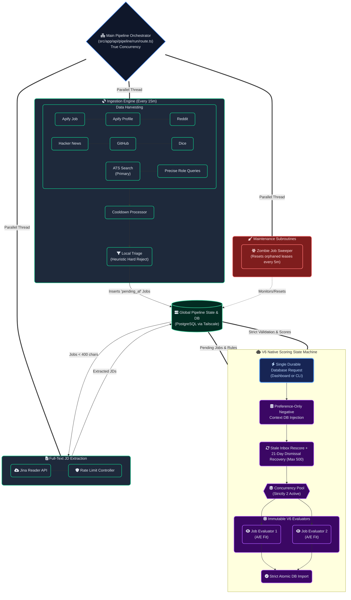

# Career Dashboard Pipeline & State Machine

This diagram maps the true concurrency orchestration, API syncs, background tasks, and the **V6.5 Native Antigravity Scoring Architecture**.

```mermaid
flowchart TD
    %% Modern Deep-Tech Styling Classes
    classDef orchestrator fill:#0f172a,stroke:#3b82f6,stroke-width:2px,color:#e2e8f0,rx:8px,ry:8px
    classDef source fill:#1e293b,stroke:#10b981,stroke-width:2px,color:#e2e8f0,rx:8px,ry:8px
    classDef subagent fill:#3b0764,stroke:#a855f7,stroke-width:2px,color:#e2e8f0,rx:8px,ry:8px
    classDef database fill:#022c22,stroke:#34d399,stroke-width:2px,color:#e2e8f0,rx:8px,ry:8px
    classDef maintenance fill:#7f1d1d,stroke:#f87171,stroke-width:2px,color:#fee2e2,rx:8px,ry:8px
    classDef highlight fill:#172554,stroke:#60a5fa,stroke-width:3px,color:#bfdbfe,rx:8px,ry:8px

    %% Core Orchestrator
    O{"fa:fa-network-wired Main Pipeline Orchestrator<br/>(src/app/api/pipeline/run/route.ts)<br/>True Concurrency"}
    class O orchestrator

    O ===|Parallel Thread| I
    O ===|Parallel Thread| J
    O ===|Parallel Thread| C
    
    %% Ingestion Engine
    subgraph I ["fa:fa-satellite-dish Ingestion Engine (Every 15m)"]
        direction TB
        subgraph Sources ["Data Harvesting"]
            direction LR
            I1[Apify Job] --- I2[Apify Profile] --- I3[Reddit]
            I4[Hacker News] --- I5[GitHub] --- I6[Dice]
            I8["ATS Search<br/>(Primary)"] --- I9["Precise Role Queries"]
        end
        
        I7[Cooldown Processor]
        I10("fa:fa-filter Local Triage<br/>(Heuristic Hard Reject)")
        
        Sources --> I7
        I7 --> I10
    end
    class I,Sources,I1,I2,I3,I4,I5,I6,I7,I8,I9,I10 source
    
    %% Jina Extraction
    subgraph J ["fa:fa-file-text Full-Text JD Extraction"]
        J1(fa:fa-cloud-download Jina Reader API)
        J2[fa:fa-shield Rate Limit Controller]
        J1 --- J2
    end
    class J,J1,J2 source
    
    %% V6 Native Scoring Architecture
    subgraph AGY ["fa:fa-robot V6 Native Scoring State Machine"]
        direction TB
        AGY1("fa:fa-bolt Single Durable Database Request<br/>(Dashboard or CLI)")
        AGY4("fa:fa-database Preference-Only Negative<br/>Context DB Injection")
        AGY6("fa:fa-rotate Stale Inbox Rescore +<br/>21-Day Dismissal Recovery (Max 500)")
        AGY2{{"fa:fa-layer-group Concurrency Pool<br/>(Strictly 2 Active)"}}
        AGY5("fa:fa-check-circle Strict Atomic DB Import")
        
        subgraph Subagents ["fa:fa-microchip Immutable V6 Evaluators"]
            direction LR
            E1("fa:fa-eye Job Evaluator 1<br/>(A/E Fit)")
            E2("fa:fa-eye Job Evaluator 2<br/>(A/E Fit)")
        end
        
        AGY1 --> AGY4
        AGY4 --> AGY6
        AGY6 --> AGY2
        AGY2 --> E1 & E2
        E1 & E2 --> AGY5
    end
    class AGY,AGY2,AGY4,AGY5,AGY6,E1,E2,Subagents subagent
    class AGY1 highlight

    %% Maintenance & Cleanup
    subgraph C ["fa:fa-broom Maintenance Subroutines"]
        Z["fa:fa-biohazard Zombie Job Sweeper<br/>(Resets orphaned leases every 5m)"]
    end
    class C,Z maintenance

    %% Master Database
    DB[("fa:fa-server Global Pipeline State & DB<br/>(PostgreSQL via Tailscale)")]
    class DB database
    
    %% Data Flow Routing
    I10 -->|Inserts 'pending_af' Jobs| DB
    DB -->|Jobs < 400 chars| J
    J -->|Extracted JDs| DB
    DB ===|Pending Jobs & Rules| AGY
    AGY ===|Strict Validation & Scores| DB
    C -.->|Monitors/Resets| DB
```
