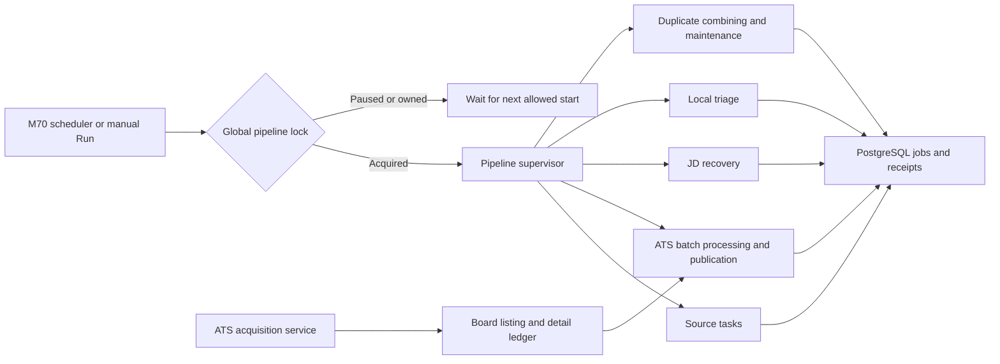
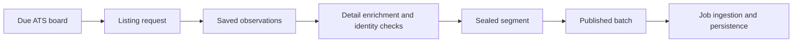
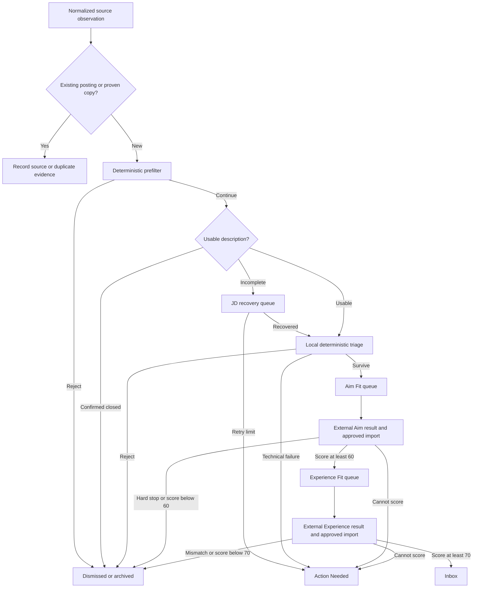
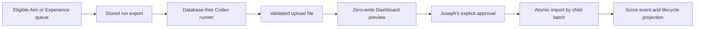

# Career Dashboard pipeline

This is a readable map of the current implementation, checked against the repository on September 29, 2026. It describes behavior and ownership, not a claim that every provider or timer is healthy right now. See the [pipeline contract](docs/CAREER_DASHBOARD_PIPELINE_CONTRACT.md) for detailed stage rules and the [M70 guide](docs/M70_PRODUCTION_OPERATIONS.md) for production operation.

## 1. Runtime and acquisition

The M70 scheduler checks for a due pipeline run every minute. A manual start uses the same global lock. The pipeline supervises independent loops, so one provider or recovery failure need not stop the others. ATS board acquisition also runs as its own M70 service and uses durable work records. The separate timers below do work outside the main pipeline.

| Separate M70 timer | Purpose |
| --- | --- |
| Scheduler | Checks pipeline start conditions every minute. |
| Watchdog | Checks repair conditions every 15 minutes, with bounded repair authority. |
| Backup | Creates daily database and runtime backups on the M70 and dedicated SSD. |
| Common Crawl discovery | Looks for candidate ATS boards weekly. Candidate discovery is distinct from active board acquisition. |
| Gusto sweep | Revisits Gusto boards through the browser on a separate 10-minute cadence. |
| Canonical URL resolver | Rechecks protected aggregator links through the browser hourly. |
| Board pruning review | Weekly liveness sweep rechecks demoted boards and may promote boards with postings or retire confirmed dead boards. Other pruning arms report candidates for approval. |

The [M70 unit files](scripts/deployment/m70/) define the schedules. A timer file being present in Git does not prove the timer is enabled on the host.

### ATS acquisition has several checkpoints

Each checkpoint has its own receipt and retry behavior. A contacted or responding board does not, by itself, prove that a complete posting reached the Dashboard. Platform fairness, provider cooldowns, a bounded worker pool, and backlog pressure determine which eligible work runs next. Previously downloaded work can continue through processing even when new board acquisition pauses.

## 2. A job's path

Arrows describe eligibility, not a single synchronous request. A source can return a duplicate, a closed page, or an incomplete description. The Dashboard protects user decisions while these background stages run.

JD recovery first tries structured provider or ATS data. Jina Reader is a fallback when structured recovery is unusable. It does not decide fit. Local triage is deterministic and does not call a model. Same-job consolidation can combine proven copies before export, after a scoring import, or during maintenance. It retains score records and provides an undo path for an incorrect combination. See the [measured combining rules](docs/SAME_JOB_CONSOLIDATION_2026-09-25.md).

| Job field | Meaning in this flow |
| --- | --- |
| `status` | Lifecycle disposition, such as `pending_af`, `inbox`, `dismissed`, or a protected human decision. |
| `scoringStatus` | Processing state, such as `needs_jd`, `queued`, `scoring`, `scored`, `skipped`, or `failed`. |
| Stage and work leases | Temporary ownership of JD recovery, local triage, or a manual scoring export; separate from both fields above. |

A local survivor remains `pending_af` with `scoringStatus = scored` until manual scoring resolves it. Inbox means the Experience threshold was met. A failed technical stage belongs in Action Needed; it is not an implicit permission to rescore.

## 3. Manual scoring exchange

The Dashboard does not run the scoring models. It creates a stored, exact export. Codex processes the JSON outside the application, and the Dashboard independently checks the returned result before any write.

- Aim and Experience are independent stages. An Aim result needs to clear the Dashboard-owned 60-point floor before Experience export. Experience checks hard requirements against the exact JD and trusted evidence, then scores qualified roles on a 0–100 scale. The Inbox floor is 70.
- New whole-queue runs contain up to **200 jobs**, split into exact 40-job child batches, and may not exceed **64 MiB**. One nonterminal run per stage can exist at a time. The same exact export can resume incomplete work.
- Experience runs with proposed `hard_requirement_mismatch` results pause for semantic review. Each mismatch must be checked against the exact JD and Core Evidence before the upload file is finalized.
- Preview performs no writes. Apply rechecks membership, inputs, hashes, current score authority, lifecycle protection, and the preview-bound approval token under transactional locks. Accepted child batches remain accepted if a later child cannot apply.
- Existing scores remain honored through prospective changes to policy, model, evidence, code, or versions. An explicit user request to remove scores or a Dashboard rescore action is required to displace them.

The [canonical resume record](docs/CANONICAL_RESUME.md) identifies the current Experience input. The [scoring runner](scripts/run_scoring_run.py) and [Experience review finalizer](scripts/finalize_experience_scoring_run.py) handle the external exchange.

## Implementation map

| Behavior | Main implementation |
| --- | --- |
| Pipeline lock, pause, and supervised loops | `src/app/api/pipeline/run/route.ts`, `src/app/api/pipeline/stop/route.ts`, `src/lib/pipelineState.ts` |
| Source scheduling, provider state, and ingestion | `src/lib/ingestionTaskCatalog.ts`, `src/lib/ingestionControl.ts`, `src/lib/jobIngestion.ts` |
| ATS listing, enrichment, publication, and batch processing | `src/lib/atsAcquisitionDispatcherV2.ts`, `src/lib/atsAcquisitionLedger.ts`, `src/lib/atsAcquisition.ts` |
| Description recovery and local triage | `src/lib/jdRecoveryPolicy.ts`, `src/app/api/jobs/batch-jd-submit/route.ts`, `src/lib/jobScoring.ts` |
| Same-job combining and undo | `src/lib/sameJobMatch.ts`, `src/lib/sameJobConsolidation.ts` |
| Manual exports, run limits, preview, and import | `src/lib/scoringRun.ts`, `src/lib/scoringLimits.ts`, `src/lib/scoringImport.ts`, `src/lib/scoringApproval.ts` |
| Durable database state and score history | `prisma/schema.prisma`, `src/lib/jobLifecycleEvents.ts` |
