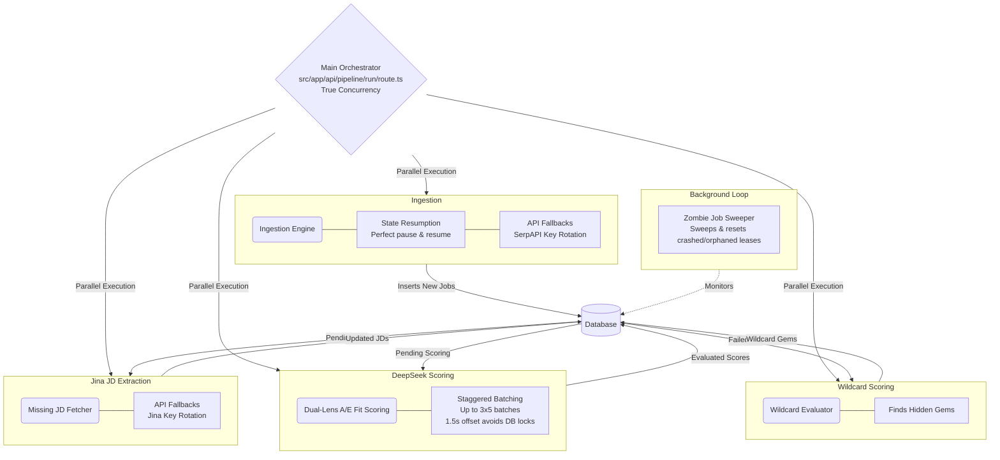

# 📷 CAREER DASHBOARD
**Instruction Manual & Reference Memory Bank (Model 2026)**

*Congratulations on your acquisition of the Career Dashboard.*

Much like an advanced 35mm reflex camera captures light and memory in perfect clarity, the Career Dashboard is precision-engineered to capture your perfect professional future. You are no longer merely "looking for a job"; you are the Director of Photography for your own career arc. This apparatus will not simply automate your tasks—it will clarify your philosophy of the hunt.

In the fast-paced modern era, a professional cannot rely on sheer volume alone, nor solely on handcrafted precision. One must marry the two. The Career Dashboard bridges this gap, balancing high-speed outreach with perfectly focused, bespoke framing.

This manual serves two purposes:
1. **The Operator's Guide:** To teach the philosophy of the hunt.
2. **The Memory Bank:** A permanent, highly detailed technical reference for future AI agents and system maintainers to understand the internal circuitry.

Please read this manual carefully before operating your Dashboard.

---

## TABLE OF CONTENTS
1. [The Philosophy of the Hunt](#1-the-philosophy-of-the-hunt)
2. [Loading the Film: Automated Job Scraping](#2-loading-the-film-automated-job-scraping)
3. [The Darkroom: Your Context DB](#3-the-darkroom-your-context-db)
4. [The Dual-Lens System: DeepSeek A/E Fit Scoring](#4-the-dual-lens-system-deepseek-ae-fit-scoring)
5. [The Wildcard Flash: Finding Hidden Gems](#5-the-wildcard-flash-finding-hidden-gems)
6. [Developing the Picture: Auto-Tailoring & ATS Discovery](#6-developing-the-picture-auto-tailoring--ats-discovery)
7. [The Slide Projector: Outreach Syncing via Apify](#7-the-slide-projector-outreach-syncing-via-apify)
8. [The Internal Optics: System Architecture & State Machine](#8-the-internal-optics-system-architecture--state-machine)
9. [Setup & Maintenance (Installation)](#9-setup--maintenance-installation)

---

## 1. THE PHILOSOPHY OF THE HUNT
To capture the perfect frame, a photographer must understand light, subject, and timing. To capture the perfect role, you must understand your value, the market's noise, and the algorithmic gatekeepers. 

Do not fall into the trap of blindly scattering identical resumes into the wind—that is like firing a flash into a mirror. Instead, use the Career Dashboard to **focus**. 

- **Volume vs. Precision:** The age-old debate. With this apparatus, you do not need to choose. You will achieve *Precision at Volume*.

> [!TIP]
> **Pro-Tip on Context Rules:** The machine only knows what you tell it. Writing a good context rule is like choosing the right film stock. If your Context DB is blurry, your output will be out of focus.

---

## 2. LOADING THE FILM: Automated Job Scraping
Before you can develop a picture, you must expose the film. The Career Dashboard’s **Automated Job Discovery** mechanism runs silently in the background, continuously spooling in fresh opportunities from the open market.

**Operator Philosophy:**
Set your search parameters (the "aperture") wide enough to catch interesting crossover roles, but narrow enough to avoid overexposing yourself to irrelevant noise. 

> [!WARNING]
> **Overexposure Warning:** Do not let the scraper run indefinitely without reviewing the spool. Calibrate your search terms weekly to ensure the light meter is reading the correct industry trends.

**Memory Bank (Under the Hood):**
The ingestion engine bypasses walled gardens, pulling natively from platforms like Reddit (`r/forhire`), Hacker News, Google Jobs, SerpApi, and direct ATS portals. We employ a hardened, automated Chromium instance (`CloakBrowser`) to reliably extract fully rendered job descriptions. 

To guarantee continuous operation, the mechanism features:
- **Ingestion State Resumption:** Should a power loss or operator interruption occur, the mechanism possesses a failsafe memory demonstrating how it safely remembers its place if stopped and restarted within 24 hours without double-exposing the film.
- **API Fallbacks:** Our light meters never fail. The system employs automatic key rotation, seamlessly swapping primary API keys if rate limits are exhausted, ensuring an uninterrupted exposure cycle.

New entries enter the database in a `pending_af` state. Truncated descriptions (< 400 chars) are routed to a background job utilizing the Jina Reader API to extract the full JD before proceeding.

---

## 3. THE DARKROOM: Your Context DB
The **Context DB** is where your raw potential is stored. This is your personal darkroom. It holds your past experiences, your unspoken skills, your career philosophies, and your core accomplishments.

**Operator Philosophy:**
Be explicit, not poetic. "I increased sales by 20% using Method X" is a sharp negative. "I am a proactive go-getter" is a blurry smudge. 

> [!CAUTION]
> **Expired Chemicals:** Update your Context DB as you grow. A master photographer does not use expired developer fluid. Keep your history sharp and factual, or the AI will have nothing to develop.

**Memory Bank (Under the Hood):**
The Context DB (`ContextProfile`) maintains a global state of your rules (`rulesText`). When a job is marked as `applied` (positive polarity) or `passed` (negative polarity), the AI Evaluator incorporates this feedback to dynamically evolve the rules text in the background, creating a `ContextRuleRevision` record. 

---

## 4. THE DUAL-LENS SYSTEM: DeepSeek A/E Fit Scoring
Analyzing thousands of job descriptions is expensive and slow. To optimize API usage, jobs first pass a lightning-fast local heuristic engine. If they survive, they are processed by our patented **DeepSeek Dual-Resume A/E Fit Scoring**. 

**Operator Philosophy:**
When you find a target role, the Dashboard analyzes it through two distinct lenses:
- **Lens A (Aim Fit / Baseline):** How well does the role align with your personal work preferences and goals?
- **Lens E (Experience Fit / Engineered):** How perfectly does your demonstrated ability meet the technical and domain requirements?

If Lens A is low but Lens E is high, you have the skills but not the desire. If both are low, do not waste your flash. Move on.

> [!NOTE]
> **API Conservation:** The Dual-Lens system is brilliant, but analyzing thousands of descriptions is expensive. The local heuristic triage ensures you aren't wasting DeepSeek tokens (and money) on jobs that are immediate mismatches.

**Memory Bank (Under the Hood):**
The `runDeepseekEvaluation` script constructs a batch payload (size 5) and calls `https://api.deepseek.com/v1/chat/completions`. It performs the evaluation twice simultaneously: once with your `coreResume` and once with a specialized variant (e.g., `csResume`).

- **DeepSeek Staggered Batching:** To prevent the motor drive from jamming the database under heavy load, the evaluator achieves peak continuous shooting by spawning 3x5 batches staggered by 1.5s. This avoids database locks while maintaining maximum throughput.
- **Scoring Engine:** Returns an `aimFitScore` (0-100), `experienceFitScore` (0-100), and a `travelScore` (0-100 based strictly on explicit travel requirements, not inferred remote policies). 
- **Domain Matching:** It determines a boolean `domainMatch`. If the role strictly requires a domain and the resume lacks it, the `experienceFitScore` is forcefully capped at 59.
- **Resume Merging:** If the specialized variant (`csResume`) scores a higher `aimFitScore`, the system merges it as the preferred application path for that specific job.
- **State Transition:** Based on `passesStandardScoring()`, the `status` flips to `inbox` (if passed) or `dismissed` (if failed). Failed jobs set `luckyStatus` to `pending`.

---

## 5. THE WILDCARD FLASH: Finding Hidden Gems
Sometimes, the best shots are the ones you didn't plan for. 

**Operator Philosophy:**
Jobs that fail the standard dual-lens evaluation act as an "I'm Feeling Lucky" Wildcard flash. The system scans strictly for high-upside, unconventional roles (e.g., founding team, AI engineering, special projects), rescuing hidden gems from the rejection pile.

**Memory Bank (Under the Hood):**
When a job is downgraded to `dismissed`, its `luckyStatus` becomes `pending`. A secondary AI evaluator specifically trained on the `WildcardProfile` schema processes these. If a gem is found, `luckyStatus` is updated to `none`, and it drops into a distinct "I'm Feeling Lucky" dashboard tab.

---

## 6. DEVELOPING THE PICTURE: Auto-Tailoring & ATS Discovery
Once a high-yield target is locked in your Human-in-the-Loop Review Dashboard, the system moves to the development phase. 

**Operator Philosophy:**
Using the precise data from your Context DB, the system auto-tailors a bespoke resume for the specific job description, outputting a review-ready draft that is optimized to pass through modern Applicant Tracking Systems (ATS).

**Memory Bank (Under the Hood):**
- **Tailoring:** Gemini 2.5 Pro surfaces the most relevant past experiences, rewrites bullet points, and populates `recommendedResume` in the database.
- **ATS Discovery & Routing:** The `identifyAts(job)` function in `atsUtils.ts` determines the underlying ATS system. It scans `source` tags (e.g., `ats-greenhouse`) or parses the `canonicalUrl` (e.g., matching `myworkdayjobs.com` -> `Workday`, `lever.co` -> `Lever`). This ensures our tailored document adheres to the specific parsing quirks (e.g., PDF vs DOCX, structural hierarchies) of 18 supported platforms (including ADP, BambooHR, Avature).

---

## 7. THE SLIDE PROJECTOR: Outreach Syncing via Apify
A beautiful photograph is useless if left in a drawer. The **Apify Outreach Sync** is your slide projector, displaying your perfectly tailored profile directly to hiring managers.

**Operator Philosophy:**
By syncing your tailored applications with automated, polite, and persistent outreach protocols, you ensure that your portfolio is placed directly on the desk of the decision-makers. Always maintain a human touch in your automated follow-ups. A completely robotic message feels like a cheap, faded polaroid.

**Memory Bank (Under the Hood):**
The outreach module triggers `harvestapi~linkedin-profile-search` via the Apify API (`https://api.apify.com/v2/acts/harvestapi~linkedin-profile-search/runs/last/dataset/items`). This validates and pulls direct LinkedIn targets (Recruiters/Hiring Managers) related to the company, syncing their `publicIdentifier` and generating specialized pitch notes in the `OutreachTarget` table for immediate deployment.

---

## 8. THE INTERNAL OPTICS: System Architecture & State Machine

The heart of the Career Dashboard is powered by a master synchronization dial, coordinating multiple internal processes simultaneously without risking overlapping exposures.

- **True Concurrency:** With the pipeline orchestrator running phases in parallel, the motor drive never waits for the shutter to close before advancing the film. 
- **The Zombie Job Sweeper:** A silent, internal maintenance subroutine providing background cleanup for orphaned leases—like a precision brush clearing dust off the mirror—ensuring no stuck jobs hold up the pipeline.

For future AI agents modifying this codebase, refer to this precise lifecycle:

1. **New Job Inserted:** `status = "pending_af"`, `scoringStatus = "queued"`, `luckyStatus = "none"`
2. **Missing JD:** Background `Jina Reader API` executes if description < 400 chars.
3. **Local Heuristic:** Tokenizes for hard-rejects -> sets `status = "dismissed"` if failed.
4. **DeepSeek Scoring (`runDeepseekEvaluation`):**
   - Batches of 5. Updates `afBatchId`.
   - On success: `scoringStatus = "scored"`. 
   - Evaluates `aimFitScore` / `experienceFitScore`.
   - Passed: `status = "inbox"`, `luckyStatus = "none"`.
   - Failed: `status = "dismissed"`, `luckyStatus = "pending"`.
5. **Wildcard Scoring:** Processes `luckyStatus = "pending"`.
6. **Manual Review:** User moves from `inbox` -> `applied` or `passed` (triggering a feedback loop back to Context DB).

> [!TIP]
> **Feedback Loops:** Moving a job to `applied` or `passed` isn't just an organizational step—it feeds directly back into your Context DB (via `ContextRuleRevision`) to automatically calibrate future scoring!



---

## 9. SETUP & MAINTENANCE (INSTALLATION)
Before you can begin your journey, you must assemble the apparatus. Follow these exact instructions to ensure optimal functionality.

1. **Unpack the Apparatus (Clone the Repository)**
   ```bash
   git clone https://github.com/j85473/career-dashboard.git
   cd career-dashboard
   ```

2. **Lubricate the Gears (Install Dependencies)**
   ```bash
   npm install
   ```

3. **Install the Batteries (Configure Environment Variables)**
   Rename the provided `.env.example` file to `.env` and carefully input your API keys (`DEEPSEEK_API_KEY`, `APIFY_API_TOKEN`, etc.). Without these, the flash will not fire.
   ```bash
   cp .env.example .env
   ```

4. **Initialize the Memory Bank (Database Setup)**
   ```bash
   npx prisma generate
   npx prisma db push
   ```

5. **Power On (Start the Application)**
   ```bash
   npm run dev
   ```

Proceed to the viewing screen at [http://localhost:3000](http://localhost:3000) to access your new command center.

*Thank you for choosing the Career Dashboard. May your exposures be perfect, your focus sharp, and your career long and prosperous.*
