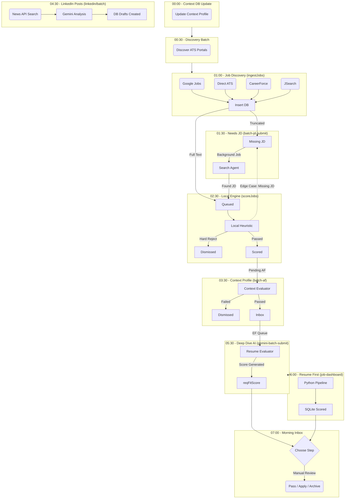

# Career Dashboard

An end-to-end applicant tracking, job parsing, and AI-assisted resume drafting and review system designed to drastically reduce the friction of the modern job search. 

> **Impact:** Built to eliminate the manual friction of the job search. This multi-agent pipeline cut my daily application triage time from hours to minutes by automatically ingesting opportunities, scoring them against my core experience using local heuristics, and generating highly targeted, review-ready resume drafts via LLMs.

This project demonstrates the ability to architect complex, multi-stage data pipelines, integrate LLMs for deep semantic reasoning, and solve difficult web automation challenges at scale.

## Architecture & Workflow

The system is built on a **Next.js** frontend with a **Prisma/SQLite** backend, orchestrated through a series of automated ingestion, scoring, and review pipelines.



### 1. Automated Discovery & Data Ingestion
To maintain a continuous flow of relevant opportunities, the system features a robust, automated discovery pipeline:
- **Common Crawl & Index Search:** Continuously monitors and extracts newly indexed career pages and Applicant Tracking System (ATS) subdomains via Common Crawl and SERP indexing APIs. 
- **Robust Web Automation:** Many modern career portals utilize heavy JavaScript rendering and complex DOM structures that fail under standard HTTP requests. This system utilizes a hardened, automated Chromium instance (CloakBrowser) to reliably extract fully rendered canonical job descriptions from these complex state applications.

### 2. Hybrid AI & Heuristic Scoring
Analyzing thousands of job descriptions is expensive and slow. To optimize API usage and latency, the pipeline utilizes a two-tier hybrid architecture:
1. **Local Heuristic Triage:** A lightning-fast, local heuristic engine performs initial parsing. It tokenizes the description, checks for hard-reject keywords (e.g., "clearance required", "senior executive"), and calculates a baseline keyword overlap with core resumes.
2. **Deep Semantic Analysis (Gemini 2.5 Flash):** Jobs that pass the heuristic floor are batched and sent to Google's **Gemini 2.5 Flash** model. The LLM performs a deep contextual analysis, assessing actual requirement overlap, extracting required years of experience, and generating a nuanced "fit rationale."

### 3. Human-in-the-Loop Review Dashboard
The Next.js React frontend serves as a centralized command center. Jobs are categorized into actionable buckets (`No Tailoring`, `Minor Tweaks`, `Heavy Rewrite`, `Dismissed`). The dashboard provides:
- Side-by-side JD vs. Resume comparisons.
- One-click trigger for AI-assisted resume tailoring.
- Automated API batch processing controls.

### 4. Generative Resume Tailoring
Once a job is approved for application, the system invokes **Gemini 2.5 Pro** to perform highly targeted resume tailoring. It restructures bullet points and surfaces the most relevant past experiences specifically mapped to the job description's core competencies, outputting a review-ready draft.

## Setup & Local Development

1. **Clone the Repository**
   ```bash
   git clone https://github.com/j85473/career-dashboard.git
   cd career-dashboard
   ```

2. **Install Dependencies**
   ```bash
   npm install
   ```

3. **Configure Environment Variables**
   Rename the provided `.env.example` file to `.env` and add your API keys.
   ```bash
   cp .env.example .env
   ```

4. **Initialize Database**
   ```bash
   npx prisma generate
   npx prisma db push
   ```

5. **Start the Application**
   ```bash
   npm run dev
   ```

Open [http://localhost:3000](http://localhost:3000) to access the dashboard.

## Technical Stack
* **Frontend:** Next.js (React), CSS Modules
* **Backend:** Next.js API Routes (Node.js)
* **Database:** Prisma ORM, SQLite
* **AI & Automation:** Google Generative AI SDK (Gemini 2.5 Flash/Pro), Puppeteer/Chromium, SerpApi, RapidAPI
