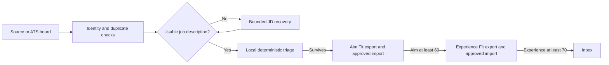

# Career Dashboard

Career Dashboard collects job postings, checks that they are usable, and helps Joseph decide which opportunities deserve attention. Automated discovery and local checks prepare jobs for review. **Aim Fit** and **Experience Fit** are separate, manual scoring exchanges: the Dashboard exports exact inputs, Codex runs outside the application, and Joseph approves the import after a preview.

Production runs on the [M70](docs/M70_PRODUCTION_OPERATIONS.md). The former Pi database is a historical archive. The Dashboard has no login screen; access is through Joseph's Tailscale network.

## At a glance

| Area | What happens |
| --- | --- |
| Discovery | Scheduled source tasks and a separate ATS acquisition worker collect postings. Board discovery and recovery have their own schedules. |
| Admission | Source identity, duplicate checks, description recovery, language and metadata checks, and local deterministic triage prepare jobs for Aim Fit. |
| Aim Fit | A manual export binds each job to its original description, trusted metadata, policy, and question registry. A result below the Dashboard's 60-point Experience queue floor does not advance. |
| Experience Fit | A separate manual export binds the current Aim result, canonical resume, and Core Evidence. A hard-requirement mismatch scores zero; a result of 70 or more enters Inbox. |
| Review | Joseph decides what to apply to, pass on, or revisit. His lifecycle decisions and existing scores remain authoritative. |

The [pipeline diagrams](PIPELINE_FLOW.md) show the job path, the separate ATS acquisition path, and the manual scoring exchange.

## How a job reaches Inbox


```mermaid
flowchart LR
    A["Source or ATS board"] --> B["Identity and duplicate checks"]
    B --> C{"Usable job description?"}
    C -->|No| D["Bounded JD recovery"]
    D --> C
    C -->|Yes| E["Local deterministic triage"]
    E -->|Survives| F["Aim Fit export and approved import"]
    F -->|Aim at least 60| G["Experience Fit export and approved import"]
    G -->|Experience at least 70| H["Inbox"]
```

Closed postings, duplicate copies, and deterministic rejections take their own documented paths. Technical failures go to **Action Needed** for review. A job with an existing score is not automatically cleared or requeued because a policy, prompt, evidence file, or version changes. Only Joseph's explicit request to remove a score or his Dashboard rescore action can change that authority.

### Discovery and recovery

The pipeline supervises source ingestion, ATS batch processing and publication, JD recovery, local triage, duplicate combining, and stale-work cleanup. The ATS acquisition worker has its own M70 service and durable ledger. It separates board listing, detail enrichment, publication, and persistence so a successful request is not confused with a usable job in the Dashboard. Provider budgets, cooldowns, and backpressure limit work.

Source tasks include configured paid searches, CareerForce, free feeds, and credential-gated providers. LinkedIn and Dice data are read from scheduled Apify datasets. A weekly Common Crawl job discovers candidate ATS boards; discovery itself does not make every board an active source. A separate weekly board review can return live demoted boards to rotation or retire confirmed dead ones; its other pruning decisions require approval. Gusto and canonical-URL browser recovery run on separate timers. The exact current task catalog and operational behavior live in the implementation and the [pipeline contract](docs/CAREER_DASHBOARD_PIPELINE_CONTRACT.md).

New postings are normalized and matched to prior observations before a new Job is created. Incomplete descriptions enter bounded recovery, which tries structured ATS or provider data before Jina Reader. A usable description then receives local, deterministic checks. Independent maintenance loops combine sufficiently proven copies across sources while preserving each copy's score history and Joseph's actions; he can undo an incorrect combination. See the [same-job rules](docs/SAME_JOB_CONSOLIDATION_2026-09-25.md).

### Manual scoring

1. In the Dashboard, export the entire eligible **Aim Fit** or **Experience Fit** queue. The download is named `START-AIM-FIT-RUN-<run-id>.json` or `START-E-FIT-RUN-<run-id>.json`.
2. Attach that exact file in Codex. The repository's manual scoring runner processes only the stage named by the file, without database access. Downloading the file alone starts nothing.
3. Review the resulting upload in the Dashboard's zero-write preview. The import applies only after explicit approval. An Experience run containing proposed hard-requirement mismatches first needs semantic review against the exact job descriptions and Core Evidence.

Each run contains child batches of 40 jobs, with a **200-job and 64 MiB limit** for new exports. The controller can resume an interrupted exact export. Accepted children stay accepted if a later child needs repair. A failed score is routed to Action Needed instead of silently cycling back into a scoring queue. The Dashboard checks batch membership, current inputs, score authority, approval token, and protected lifecycle state again when applying a result.

The [canonical resume record](docs/CANONICAL_RESUME.md) identifies the approved Channel Business Manager resume used for future Experience exports. The [Core Evidence inventory](docs/Candidate_Evidence_Inventory_-_Core_v1.md) defines factual candidate claims. Replacing either input affects future exports; it does not rewrite past scores.

## Local development

Use **Node 24**, as specified by `.nvmrc`, and a PostgreSQL database configured in `.env`:

```bash
nvm install
nvm use
npm ci
cp -n .env.example .env
npx prisma generate
npm run dev
```

Edit `.env` with local credentials before starting. The `cp -n` command leaves an existing `.env` untouched. Open <http://localhost:3000>. Database migrations and production releases should follow the [M70 operations guide](docs/M70_PRODUCTION_OPERATIONS.md); do not use a local schema command against production as a setup shortcut.

## Reference map

| Need | Start here |
| --- | --- |
| Understand every stage and state transition | [Pipeline flow](PIPELINE_FLOW.md) and [pipeline contract](docs/CAREER_DASHBOARD_PIPELINE_CONTRACT.md) |
| Operate or release production | [M70 operations](docs/M70_PRODUCTION_OPERATIONS.md) |
| Check the supported Node runtime | [Node runtime alignment](docs/NODE_RUNTIME_ALIGNMENT.md) |
| Change a pipeline or scoring rule safely | [Pipeline change guardrails](docs/CAREER_DASHBOARD_PIPELINE_CHANGE_GUARDRAILS.md) |
| Check resume and evidence authority | [Canonical resume](docs/CANONICAL_RESUME.md) and [Core Evidence](docs/Candidate_Evidence_Inventory_-_Core_v1.md) |
| Understand saved job documents | [Job documents](docs/JOB_DOCUMENTS.md) |

Historical investigations and implementation plans remain in `docs/` for context; the links above are the starting points for current behavior.
