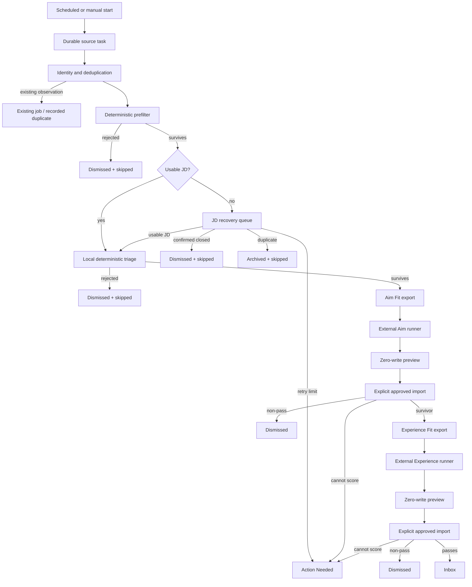

# Career Dashboard Pipeline Contract

**Status:** Current intended behavior, verified against the checked-out source on 2026-08-30.
**Purpose:** Make the job flow explicit enough that a change to one stage cannot silently bypass, strand, or misroute another stage.
**Scope:** Discovery through Inbox admission, including the manual Aim Fit and Experience Fit exchange. This is a behavior contract, not a production-health report.

## 1. The pipeline in one view



The arrows express dependency, not execution timing. The full pipeline supervises ingestion, JD recovery, local scoring, and stale-lease cleanup concurrently. A particular job must still satisfy the stage contract before it can enter the next stage.

## 2. The two state axes

Each job has two deliberately separate state axes. Do not infer one from the other.

| Field | Question it answers | Important values in this flow |
| --- | --- | --- |
| `Job.status` | What is the job's lifecycle disposition? | `pending_af`, `inbox`, `dismissed`, `archived`, and user-owned lifecycle states such as `applied` or `interviewing` |
| `Job.scoringStatus` | What processing work is required or complete? | `needs_jd`, `queued`, `scoring`, `scored`, `skipped`, `failed` |

`pending_af` is the machine-processing lifecycle state. Local survivors remain there until the two manual scoring stages make an Inbox decision. `inbox` is therefore a completed acceptance state, not a synonym for "ready to score." A protected human lifecycle state must not be overwritten by a background stage.

Execution leases are separate from both state axes:

| Lease | Owner | Meaning |
| --- | --- | --- |
| `jdBatchId` | JD recovery | The row is claimed for bounded JD recovery. |
| `batchJobId` | Local scoring | The row is claimed for local triage. |
| `ScoringBatchItem` / manual batch data | Manual Aim or Experience exchange | The job is leased to a stored export until a valid result is imported or the lease is released. |

No stage may leave its lease set when it returns the job to a queue. A queue record with a leftover lease is a stranded job, not a harmless cosmetic inconsistency.

## 3. Canonical job-stage contract

### 3.1 Discovery, identity, and prefilter

**Owner:** `src/lib/jobIngestion.ts`

1. A durable `IngestionTask` claims a source/query/geography work item.
2. The source result is normalized and reconciled against a source observation and posting identity. A duplicate is recorded; it is not a new job.
3. The deterministic prefilter runs before downstream work. A rejected job becomes `status = dismissed` and `scoringStatus = skipped` (manual imports preserve their lifecycle status).
4. A surviving job with a complete enough JD enters `scoringStatus = queued`; an incomplete JD enters `scoringStatus = needs_jd`.
5. A positively detected closed posting is a disposition: `status = dismissed`, `scoringStatus = skipped`, and pass reason `Job posting is closed.` It is not a retryable recovery error.

The ingestion prefilter is a cheap, deterministic filter. It must not claim to be Aim Fit or Experience Fit, and it must not use the absence of evidence as a negative qualification conclusion.

### 3.2 JD quality and recovery

**Owners:** `src/lib/jobDescriptionQuality.ts`, `src/lib/jdRecoveryPolicy.ts`, and `src/app/api/jobs/batch-jd-submit/route.ts`

The JD gate admits text to local scoring only when it is safe enough to evaluate:

- reject known terminal, cookie, login, portal-shell, short, and visibly truncated content;
- for ordinary rendered-page content, require recognizable duties and qualifications as well as the minimum usable length;
- for a direct structured ATS posting-description field, retain the terminal/length/truncation checks but do not require English section-heading wording a second time;
- treat a confirmed closure separately from an unsuccessful recovery attempt.

Recovery is bounded to three attempts. The required outcomes are:

| Recovery outcome | Required result |
| --- | --- |
| Existing or recovered JD is ready | Clear `jdBatchId`, clear any stale local lease, reset recovery errors, set `scoringStatus = queued`. It proceeds to local triage. |
| Confirmed closed posting | Dismiss and skip. Do not retry or show it as a recovery failure. |
| Duplicate after recovery | Archive and skip the duplicate record. |
| Bad but retryable response | Clear the JD lease, increment the recovery attempt, retain `scoringStatus = needs_jd`. |
| Third failed attempt or interrupted lease at the limit | Clear the lease, set `scoringStatus = failed`, and retain the job for Action Needed. Do not silently dismiss it. |

The recovery route tries an ATS-specific API first and uses Jina only as a bounded fallback. A successful HTTP response is not sufficient; the shared quality decision controls admission. On a successful batch, recovery calls local scoring only for the recovered job IDs. That convenience must preserve the same local-triage contract as the normal queue.

### 3.3 Local deterministic triage

**Owner:** `src/lib/jobScoring.ts`

Local scoring is the only automatic stage after a usable JD and before the manual A/E exchange.

1. Claim only a job with `scoringStatus = queued`, no JD lease, no local lease, and an active lifecycle (`pending_af` or `inbox`). The claim atomically sets `scoringStatus = scoring` and a local lease.
2. Resolve the canonical description and re-run the deterministic prefilter with the best available metadata.
3. From a usable JD only, extract the facts the posting states outright. These are display fields, never scoring inputs, and nothing here infers: an extractor either finds an unambiguous literal statement or records nothing.
   - **Posted base salary.** One explicit employer-posted **base** range. Stored separately from score-derived compensation and displayed after the ATS badge. OTE, total compensation, bonus, commission, any non-annual period (hourly, monthly, weekly, biweekly, daily), and multiple location-specific ranges do not qualify. A monthly range is dropped rather than annualized, because rescaling would be inference.
   - **Posted travel.** The travel expectation the posting names — a percentage, a range, or an unambiguous "no travel"/"minimal". Hedged wording ("some travel may be required") does not qualify, nor do percentages belonging to benefits such as travel reimbursement. Two conflicting figures fail closed. This is text, not a score: `Job.travelScore` is the retired pre-v2 numeric field and is no longer written.
   - Both are derived wherever the description is persisted — at ingest and again when JD recovery supplies a fuller description — so a re-scrape can never leave a stale figure attached to a posting that no longer states it.
4. If the description is incomplete or severely truncated, return it to `needs_jd` (or Action Needed at the retry limit). If it is closed, dismiss and skip it.
5. Apply local title/motion triage. A deterministic rejection becomes `dismissed + skipped`; a survivor becomes `scored` and retains its processing lifecycle.
6. On an operational error, release the local lease and retry through `queued` until the limit; then surface `failed` in Action Needed.

Local scoring may reject an obvious non-target role without an external model call. It may never promote a job to `inbox`, skip Aim Fit, or skip Experience Fit.

### 3.4 Manual Aim Fit and Experience Fit exchange

**Owners:** `src/lib/manualScoringEligibility.ts`, `src/lib/scoringExport.ts`, `src/lib/scoringRun.ts`, `src/lib/scoringImport.ts`, and `src/lib/scoringRunImport.ts`

Manual scoring is an explicit, database-free exchange, not a background model loop:

1. **Aim export:** select every currently eligible `pending_af` job that completed local scoring (`scoringStatus = scored`), has a description, is not manually leased, and is eligible under the user-lifecycle rules. One stored parent run reserves the snapshot and binds exact 40-job child exports. A 2,000-job and 64 MiB pre-lease safety ceiling prevents an unexpectedly unbounded exchange.
2. **Aim result:** an external runner produces the result JSON. Dashboard preview validates membership, hashes, input versions, source identity, result structure, and lifecycle projection without writing job records.
3. **Aim apply:** only an explicit run-preview approval token permits import. Each child applies in its own existing serializable transaction. A scored survivor remains `pending_af`; a rejection is dismissed. A safe failure remains Action Needed rather than being mistaken for a fit rejection.
4. **Experience export:** selects every currently eligible `pending_af` job that has an authoritative, current Aim survivor and stores the same parent/40-job-child structure.
5. **Experience review and apply:** any `hard_requirement_mismatch` blocks final artifact publication until the main Codex agent audits it against the exact JD and complete Core Evidence and produces the exact approved review receipt. Only a passing Experience result admits an unprotected job to `inbox`. A non-passing result is dismissed. A stage failure is Action Needed, not a rejection inferred from silence.

The Dashboard flow is therefore:

```text
Log -> whole Aim queue export -> two concurrent 40-job children -> one Aim result
    -> zero-write run preview -> explicit child-atomic apply
    -> whole Experience queue export -> two concurrent 40-job children
    -> hard-mismatch semantic audit when required -> one Experience result
    -> zero-write run preview -> explicit child-atomic apply -> Inbox
```

Generating a result file, downloading an export, or previewing an import is never authorization to mutate the Dashboard database.

The external run controller at `scripts/run_scoring_run.py` has no Dashboard or
database access. It validates the immutable parent and child manifests,
persists local recovery state, runs at most two child batches concurrently,
and enforces one four-call semaphore across the full run. Restarting the same
exact input skips hash-validated completed children. It emits one consolidated,
byte-verified Desktop upload only after all children finish and, for Experience,
the required semantic audit is complete. It never previews, applies, releases,
or combines Aim and Experience on its own.

Run import is intentionally atomic per child rather than across the entire
queue. If a later child fails current-input or lifecycle validation, earlier
children remain durably accepted and the operator re-previews the same run to
continue. Explicit run release frees only still-leased children and preserves
all previously accepted scores. Superseded children stay visible as a blocked
run until that release; no scoring change automatically invalidates historical
accepted scores.

## 4. Scheduler and concurrency contract

**Entrypoint:** `scripts/cron/run_pipeline.ts` calls the authenticated pipeline route. A person can also start the route from the Dashboard.

The full runner in `src/app/api/pipeline/run/route.ts` has one shared, durable `PipelineState` lock and supervises seven independent work loops plus one read-only telemetry loop:

| Loop | Owns | May not take down |
| --- | --- | --- |
| Source ingestion | Non-ATS durable source tasks, provider work, source counters, and source task completion | ATS work, JD recovery, local scoring, or stale-lease cleanup |
| ATS listing/detail acquisition or legacy fallback | Direct ATS board selection plus listing and per-posting detail API turns | Parent-side batch normalization/persistence, other sources, JD recovery, local scoring, or cleanup |
| ATS segment publication | Sealed v2 manifests, publication credits, and the sealed-to-published handoff | ATS API acquisition, normalization/persistence, other sources, JD recovery, local scoring, or cleanup |
| ATS batch processing | Durable synchronized ATS payloads, normalization, job writes, and processing leases | Listing coverage, other sources, JD recovery, local scoring, or cleanup |
| JD recovery | Jobs in `needs_jd`, their bounded recovery leases, and recovery retry state | Ingestion, local scoring, or cleanup |
| Local scoring | Jobs in `queued`, their local leases, and deterministic local triage | Ingestion, JD recovery, or cleanup |
| Stale-lease cleanup | Recoverable leases after their bounded timeout | The active owner of a live lease |
| ATS remote telemetry | Durable remote-host, lane, and lifecycle backlog observations | Every work loop |

An error in one supervised loop is recorded as a warning and restarted with bounded backoff. It must not cancel unrelated loops. The pipeline stop endpoint signals the shared state and local abort controller; each loop releases its own work cleanly.

The scheduler owns source cadence, not the legacy orchestration marker. Every source task is identified by source, query family, geography lane, and ingestion mode. Its next execution time is anchored to actual completion, with provider retry times and deterministic jitter for blocked budget/circuit cases. The historical `scheduler:v2:legacy-orchestration` row is orchestration metadata, never a runnable source task.

### 4.1 Direct ATS process boundary

Split mode isolates direct ATS **listing and per-posting detail acquisition** in one attached Node child process:

```text
Next.js pipeline parent (global lock + PipelineState writer)
    -> attached ATS acquisition child (listing/detail calls + enriched durable batch handoff)
    -> parent ATS segment publisher (network-free sealed-to-published handoff)
    -> parent ATS batch consumer (network-complete normalization + Job persistence)
```

The parent launches `scripts/workers/ats-acquisition.ts` with Node's production `tsx` loader and IPC enabled. The child has a different OS PID, is not detached, and receives its own `DATABASE_URL` with `connection_limit=4`, `pool_timeout=5`, and `connect_timeout=5`. Existing datasource options such as schema and SSL mode are preserved. `tsx` is therefore a production dependency, not a development-only convenience.

Only the parent writes `PipelineState`, owns the global pipeline lock, and decides the final run status. The child reads the shared stop state, claims only the `Direct ATS acquisition` task, calls listing and required per-posting detail endpoints, and persists `AtsBoardCheckAttempt` / `AtsIngestionBatch` receipts. Each durable listing carries a versioned enrichment marker recording whether detail work was enriched, unnecessary, or unavailable, plus any description, company, location, and compensation overrides. The child reports `ready`, `progress`, `warning`, `fatal`, and `stopped` messages over structured IPC. The parent consumes that marker as a network-complete handoff: it may normalize and persist the job, but it may not call a legacy detail adapter, redirect resolver, canonical resolver, generic ATS scraper, or description-recovery fetch for that prefetched item. Legacy non-prefetched mode retains its existing in-process acquisition behavior.

The stop order is contractual:

1. The shared stop request aborts the parent controller; the child also observes the database stop flag independently.
2. The parent sends the exact child a structured stop message and allows a bounded grace period for its current durable receipt.
3. If needed, the parent sends `SIGTERM` and then `SIGKILL` to that exact PID. It never signals a broad process group.
4. The parent awaits the child's close event before the supervisor settles and before releasing the global lock.
5. The child also stops on `SIGTERM`, `SIGINT`, or IPC disconnect, so a dead parent cannot leave an orphan acquisition loop.

An unexpected child exit rejects one supervised turn only after that PID is closed. The existing sequential loop supervisor then starts exactly one replacement with bounded backoff; two acquisition children may never overlap under one pipeline parent.

This attached-child design is the production contract for the existing one-service deployment. Separate systemd units would create a second independent lifecycle and would require another cross-unit lock, coordinated stop/readiness, and deploy-quiescence protocol. They are not safer for this deployment unless those controls are designed and deployed together.

An optional Mac continuation worker is the one deliberately designed exception
to that single-service rule. It remains disabled unless the durable distributed
gate is active. It shares the Pi PostgreSQL ledger over the private network,
holds only slot numbers above the Pi's local reserve, follows the authoritative
pipeline stop state, and claims only already-admitted v2 continuation work. It
does not own `PipelineState`, daily coverage admission, cron, migrations,
normal source ingestion, scoring, or a second database. Lost capacity leases
stop its dispatcher; lost work leases are recovered by the ordinary v2 fence
and expiry path. Remote claims fail closed until a compatible Pi child visibly
holds all four local capacity leases, preventing an older uncoordinated Pi
process from overlapping the Mac. The Pi must remain correct with every remote
slot absent.

Every distributed slot also carries the exact 40-character Git release ID.
Remote claims require all four Pi slots to carry the same release, preventing a
new Mac checkout from pairing with an older Pi binary. The Mac LaunchAgent
restarts unexpected failures but not a clean pipeline-stop exit. This is part
of deploy quiescence: a future release must update the Mac checkout and be
explicitly kicked off again after the Pi deployment is healthy.

Clean-cutover failure resolution is receipt-based, never destructive. A
terminal legacy batch may stop blocking the cutover only when both the command
and a database insert trigger prove that it has an exactly empty payload, zero
jobs and processing counters, no live processing or acquisition claim, and no
page, observation, item, work-receipt, sweep, or segment children. The original
failed batch, provider error, and retry history remain unchanged. One immutable
`AtsZeroJobFailureResolution` records the evidence hash, and the cutover
snapshot binds the complete resolution manifest hash and count. Such a receipt
does not count as daily board coverage; only a confirmed listing transport can
do that. Any non-empty or ambiguous failure remains an unresolved blocker.

### 4.2 ATS task mode and durable handoff

The split-mode switch is a scoped scheduler lifecycle transition, performed by the parent inside a database transaction before either ATS source lane starts:

- split mode activates the exact `Direct ATS acquisition` task and retires only legacy `ATS-*` rows whose ingestion mode is `ats`;
- fallback mode retires the exact acquisition task and reactivates legacy tasks for known ATS platforms;
- counters, cursor, watermark, cadence, attempt history, and completion/error timestamps are preserved;
- no row with a lease token or `running` status is mutated. A conflicting lease blocks the entire transition instead of permitting both modes to overlap.

The ATS batch consumer runs in both modes. Changing the kill switch therefore changes who produces new network-complete listing payloads without stranding synchronized batches already queued by split mode.

Acquisition task completion is evidence-based: every selected board must synchronize for `succeeded`; pagination, deferral, or mixed success/error is `partial`; an all-error turn is `failed`; and stop is `interrupted` in the cursor with a partial task status. Interrupted and partial turns do not advance the success watermark.

The handoff is durable and bounded. Before the consumer writes any `Job`, it verifies the stored payload length, hash, processing cursor, and cumulative counters. It then consumes a small chunk, persists the next offset and mutually exclusive outcome counters, releases the lease, and lets older untouched batches interleave fairly. A committed prefix is never replayed after a normal interruption. A zero-progress interruption backs off instead of hot-looping; a persistently malformed item receives bounded retries and then leaves a terminal failed receipt with its payload retained for audit rather than stranding the rest of the board.

Listing and detail calls share durable platform protection inside the acquisition child. A platform-wide cooldown defers the current unprocessed suffix instead of publishing a detail-less job as complete. Workable list and detail requests additionally use one expiring, fenced `ProviderCircuit` request lease because its upstream throttle is account-wide; the database connection is not held while the network request runs. Once the enriched payload is synchronized, the parent-side consumer performs no ATS or detail network fallback.

Before starting a detail request, the child may reject a listing only from a
field that the platform's detail adapter cannot change. The current shared gate
uses the listing title; it must not use Workday, Breezy, Rippling, or other
provider fields whose detail response can authoritatively replace company,
location, description, or compensation. Within one bounded enrichment chunk,
all no-request outcomes are planned first and share one fenced payload/cursor
checkpoint. Items that still require detail remain byte-for-byte untouched
until their ordinary request/response receipts complete.

### 4.3 Expand-only acquisition ledger compatibility boundary

The additive ATS acquisition ledger and Phase 2 runtime are present but dormant
unless their independent canary flags are enabled.
`AtsIngestionBatch.payload`, `metadata`, `cursor`, existing attempts, and the
prequeue-compaction receipt remain the sole authority for every legacy batch.
No conversion, v2 scheduler, segmented publication, or raw-payload archival is
enabled merely because the tables and runtime code exist.

The dormant ledger separates future authority into immutable page responses,
raw listing observations, one explicit resolution per observation, row-granular
canonical items, bounded work receipts, endpoint-sweep/daily-contact receipts,
and non-overlapping immutable consumer segments. The exact daily-contact series
comes only from a confirmed listing transport receipt; the historical
`AtsBoardCheckAttempt.contactedAt` series remains visible as legacy claim-contact
telemetry because it can include listing continuation and detail-only work.

For a board explicitly assigned to the v2 engine, the runtime contract is:

1. Every provider page is an immutable hashed receipt. Ordinary pages create
   row-granular observations in the same transaction; oversized pages retain
   one immutable body and materialize bounded observation chunks.
2. The acquisition child continuously dispatches bounded coverage and
   continuation quanta. Total acquisition concurrency remains four: one to four
   configured slots may be assigned to v2, and legacy receives the remainder,
   including zero after every rotating board is assigned to v2.
3. Chicago-local required-by-now coverage, a bounded catch-up burst, staging
   capacity, and continuation eligibility determine the elastic lane split.
   A finished quantum asks for another claim immediately; there is no selected-
   25 barrier in the v2 lane.
4. Raw observations resolve to canonical items or exact terminal compaction
   receipts. Enrichment changes only the fenced item overlay and terminal state;
   it never rewrites an accumulated board payload.
5. Terminal contiguous item ranges seal into immutable manifests. A separate
   continuous loop in the Pi pipeline parent publishes the globally oldest
   sealed manifests without consuming an ATS request slot. It remains live
   when the Pi acquisition child stands down because the Mac owns every API
   lane. Each iteration is
   bounded to ten segments, takes the existing advisory transaction lock, and
   honors the persistent 2,000/1,000-style high/low credits before handing the
   parent consumer only bounded segments.
6. The parent retains the prefetched network-free rule and existing atomic Job
   outcome identity. Segment retries reuse the source batch ID plus canonical
   item ordinal, so a crash after a Job commit cannot duplicate that outcome.
7. Processing an individual segment never completes its board cycle by itself.
   Whole-board completion requires listing and observation reconciliation, all
   canonical items terminal, every expected manifest processed with exact
   offsets and outcome counters, the synchronized boundary, and no live batch,
   item, work-receipt, or segment lease.

The database rejects update/delete of raw page, observation, resolution, item,
or segment-manifest evidence. Page materialization, pending-item enrichment,
segment publication/leases/counters, and v2 batch lifecycle summaries may
advance only through their monotonic bounds and fences. V2 lifecycle summaries
also require a transaction-local writer capability; it does not authorize any
legacy payload, cursor, counter, or consumer-lease mutation.

Cross-version safety is database-enforced:

1. `AtsCompany.acquisitionEngine` and `AtsIngestionBatch.writerMode` default to
   `legacy`; current selectors and payload writers accept only that mode.
2. Attempt and batch triggers take row locks and reject a legacy claim or
   payload/cursor mutation after a board or batch enters `converting` or `v2`,
   including a write from a pre-v2 binary.
3. The dormant conversion-claim function atomically locks the board and batch
   and refuses any batch with a running legacy attempt or consumer lease.
4. The acquisition child checks the singleton runtime capability gate before
   reporting ready. V2 activation requires writer version 3; the database
   triggers remain the final protection if an older application bypasses
   startup readiness.
5. Ledger version and active generation cannot move backward, and a converted
   batch cannot return to the legacy JSON writer. Operational rollback is a
   flag-based pause plus a compatible roll-forward.

Active legacy `fetching` and `partial` batches may move to v2 only through the
fenced legacy converter. It accepts no synchronized or consumer-progressed
batch. The converter byte-preserves the legacy payload, metadata, cursor, and
attempt history; imports the fetched prefix as deterministic append-only
`legacy_import` evidence; requires the cursor to match the exact terminal
prefix while preserving every durable current-version marker elsewhere in the
payload as a terminal overlay; and activates v2 only after page, resolution,
item, compaction, and terminal counts reconcile. A failure before activation
leaves the board in resumable `converting` authority and never routes it back
to the legacy writer. The import itself creates no new daily-contact receipt
and performs no provider request or `Job` write.

The dormant implementation does not change Job rows, `JobSourceObservation`,
application lifecycle, or Aim/Experience score authority. Physical archival,
partition detach, purge, production conversion, feature-flag activation, and
deployment require separate explicit approval.

## 5. Audit evidence and observability

The mutable `Job` row tells us the current state. It is not enough to reconstruct how the job got there.

- `JobPipelineEvent` is the append-only, idempotent trail for ingestion, prefilter, JD readiness/recovery, local outcomes, manual A/E outcomes, user lifecycle changes, duplicates, and processing errors.
- `JobSourceObservation` preserves source identity and source-task attribution.
- `IngestionTask` preserves task lifecycle, lease, counters, watermark, cursor, error state, and next-run time.
- `JobScoreEvent` is the immutable authority for imported Aim and Experience decisions.
- `PipelineStateEvent` records run, stop, pause, warning, and error transitions for the shared runner.

For ingestion telemetry, reconcile `seen = inserted + duplicates + filtered + processingErrors`. Provider/request errors are separate operational telemetry; they are not failed individual jobs and must not be included in the seen-job denominator.

## 6. Invariants that changes must preserve

1. Every surviving job is either in a known next-stage queue, leased by exactly one active stage, completed, deliberately skipped, or visible in Action Needed.
2. No stage advances a job merely because an HTTP request succeeded; admission is based on the stage's shared validation contract.
3. A closed posting, a duplicate, a deterministic local rejection, an operational failure, and a model-fit rejection have different meanings and must remain separately observable.
4. `needs_jd -> queued -> scoring -> scored` is the automatic survivor path. Recovery must not jump directly to Aim or Inbox.
5. Local triage is a cost-control and deterministic routing stage; it is not an automatic acceptance authority.
6. Aim and Experience scoring are separate stored exchanges. Preview is zero-write; apply requires explicit approval and validates the stored export against current source inputs.
7. Human lifecycle decisions are protected. Background work must not revive, dismiss, or overwrite a user-owned lifecycle state unless an explicit route authorizes that action.
8. A provider failure is contained to its task. It may change that task's retry state, but it must not stop unrelated job stages.
9. A retryable failure consumes a bounded attempt and eventually reaches Action Needed; it may not spin forever or be silently discarded.
10. A queue transition clears the previous stage's lease. A job with contradictory queue/lease values is a correctness defect.

## 7. Code ownership map

| Concern | Primary owner |
| --- | --- |
| Full-run lock, loop supervision, stops, stale-lease cleanup | `src/app/api/pipeline/run/route.ts`, `src/lib/pipelineState.ts` |
| Source catalog, scheduling, task leases, counters, and completion cadence | `src/lib/ingestionTaskCatalog.ts`, `src/lib/ingestionControl.ts` |
| Source ingestion, identity, deduplication, and initial routing | `src/lib/jobIngestion.ts` |
| JD validity and closed-posting detection | `src/lib/jobDescriptionQuality.ts` |
| Bounded recovery decisions and terminal/reconciliation updates | `src/lib/jdRecoveryPolicy.ts` |
| JD recovery execution | `src/app/api/jobs/batch-jd-submit/route.ts` |
| Local claim, canonical-description resolution, and deterministic triage | `src/lib/jobScoring.ts` |
| Manual stage eligibility and export | `src/lib/manualScoringEligibility.ts`, `src/lib/scoringExport.ts` |
| Preview, approval, atomic import, score authority, and lifecycle projection | `src/lib/scoringImport.ts`, `src/lib/scoringApproval.ts` |

## 8. Reading this contract during an incident

Start with the exact job state and recent immutable events, then ask one narrow question at a time:

1. Was the job discovered, filtered, deduplicated, or rejected before creation?
2. If it is in `needs_jd`, is the JD lease active, stale, retryable, terminal, or actually a confirmed closure?
3. If it is `queued`, is a stale lease preventing local scoring from claiming it?
4. If it is `scored + pending_af`, was the next manual export created, leased, previewed, or applied?
5. If it is `failed`, what stage created the failure and is it correctly shown as Action Needed rather than dismissed?
6. If a source is behind, is the source task due/running/blocked/retired, and does its counter reconciliation hold?

Do not diagnose from a single Dashboard count alone. Use the job row, its pipeline events, relevant lease, and the owning task or batch record together.
