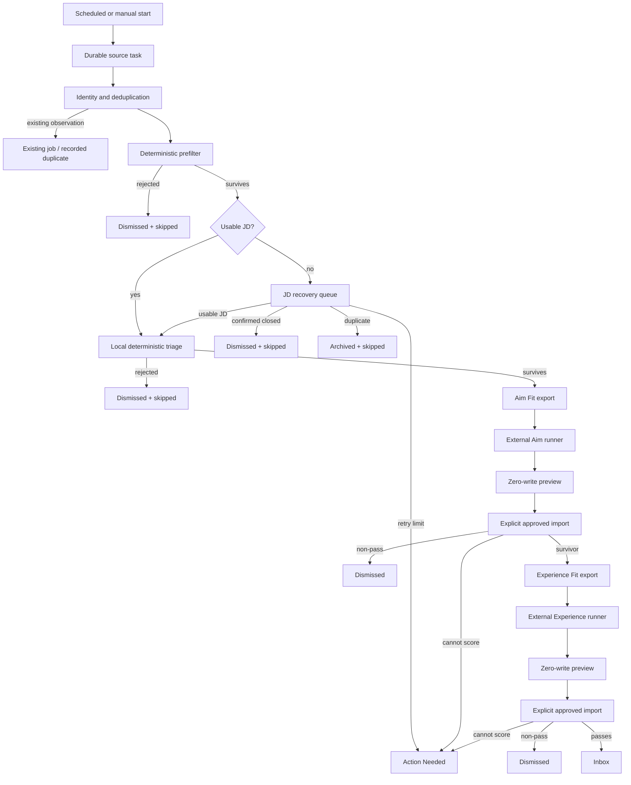

# Career Dashboard Pipeline Contract

**Status:** Current intended behavior, verified against the checked-out source on 2026-08-16.
**Purpose:** Make the job flow explicit enough that a change to one stage cannot silently bypass, strand, or misroute another stage.
**Scope:** Discovery through Inbox admission, including the manual Aim Fit and Experience Fit exchange. This is a behavior contract, not a production-health report.

## 1. The pipeline in one view



The arrows express dependency, not execution timing. The full pipeline supervises ingestion, JD recovery, local scoring, and stale-lease cleanup concurrently. A particular job must still satisfy the stage contract before it can enter the next stage.

## 2. The two state axes

Each job has two deliberately separate state axes. Do not infer one from the other.

| Field | Question it answers | Important values in this flow |
| --- | --- | --- |
| `Job.status` | What is the job's lifecycle disposition? | `pending_af`, `inbox`, `dismissed`, `archived`, and user-owned lifecycle states such as `applied` or `interviewing` |
| `Job.scoringStatus` | What processing work is required or complete? | `needs_jd`, `queued`, `scoring`, `scored`, `skipped`, `failed` |

`pending_af` is the machine-processing lifecycle state. Local survivors remain there until the two manual scoring stages make an Inbox decision. `inbox` is therefore a completed acceptance state, not a synonym for "ready to score." A protected human lifecycle state must not be overwritten by a background stage.

Execution leases are separate from both state axes:

| Lease | Owner | Meaning |
| --- | --- | --- |
| `jdBatchId` | JD recovery | The row is claimed for bounded JD recovery. |
| `batchJobId` | Local scoring | The row is claimed for local triage. |
| `ScoringBatchItem` / manual batch data | Manual Aim or Experience exchange | The job is leased to a stored export until a valid result is imported or the lease is released. |

No stage may leave its lease set when it returns the job to a queue. A queue record with a leftover lease is a stranded job, not a harmless cosmetic inconsistency.

## 3. Canonical job-stage contract

### 3.1 Discovery, identity, and prefilter

**Owner:** `src/lib/jobIngestion.ts`

1. A durable `IngestionTask` claims a source/query/geography work item.
2. The source result is normalized and reconciled against a source observation and posting identity. A duplicate is recorded; it is not a new job.
3. The deterministic prefilter runs before downstream work. A rejected job becomes `status = dismissed` and `scoringStatus = skipped` (manual imports preserve their lifecycle status).
4. A surviving job with a complete enough JD enters `scoringStatus = queued`; an incomplete JD enters `scoringStatus = needs_jd`.
5. A positively detected closed posting is a disposition: `status = dismissed`, `scoringStatus = skipped`, and pass reason `Job posting is closed.` It is not a retryable recovery error.

The ingestion prefilter is a cheap, deterministic filter. It must not claim to be Aim Fit or Experience Fit, and it must not use the absence of evidence as a negative qualification conclusion.

### 3.2 JD quality and recovery

**Owners:** `src/lib/jobDescriptionQuality.ts`, `src/lib/jdRecoveryPolicy.ts`, and `src/app/api/jobs/batch-jd-submit/route.ts`

The JD gate admits text to local scoring only when it is safe enough to evaluate:

- reject known terminal, cookie, login, portal-shell, short, and visibly truncated content;
- for ordinary rendered-page content, require recognizable duties and qualifications as well as the minimum usable length;
- for a direct structured ATS posting-description field, retain the terminal/length/truncation checks but do not require English section-heading wording a second time;
- treat a confirmed closure separately from an unsuccessful recovery attempt.

Recovery is bounded to three attempts. The required outcomes are:

| Recovery outcome | Required result |
| --- | --- |
| Existing or recovered JD is ready | Clear `jdBatchId`, clear any stale local lease, reset recovery errors, set `scoringStatus = queued`. It proceeds to local triage. |
| Confirmed closed posting | Dismiss and skip. Do not retry or show it as a recovery failure. |
| Duplicate after recovery | Archive and skip the duplicate record. |
| Bad but retryable response | Clear the JD lease, increment the recovery attempt, retain `scoringStatus = needs_jd`. |
| Third failed attempt or interrupted lease at the limit | Clear the lease, set `scoringStatus = failed`, and retain the job for Action Needed. Do not silently dismiss it. |

The recovery route tries an ATS-specific API first and uses Jina only as a bounded fallback. A successful HTTP response is not sufficient; the shared quality decision controls admission. On a successful batch, recovery calls local scoring only for the recovered job IDs. That convenience must preserve the same local-triage contract as the normal queue.

### 3.3 Local deterministic triage

**Owner:** `src/lib/jobScoring.ts`

Local scoring is the only automatic stage after a usable JD and before the manual A/E exchange.

1. Claim only a job with `scoringStatus = queued`, no JD lease, no local lease, and an active lifecycle (`pending_af` or `inbox`). The claim atomically sets `scoringStatus = scoring` and a local lease.
2. Resolve the canonical description and re-run the deterministic prefilter with the best available metadata.
3. From a usable JD only, extract the facts the posting states outright. These are display fields, never scoring inputs, and nothing here infers: an extractor either finds an unambiguous literal statement or records nothing.
   - **Posted base salary.** One explicit employer-posted **base** range. Stored separately from score-derived compensation and displayed after the ATS badge. OTE, total compensation, bonus, commission, any non-annual period (hourly, monthly, weekly, biweekly, daily), and multiple location-specific ranges do not qualify. A monthly range is dropped rather than annualized, because rescaling would be inference.
   - **Posted travel.** The travel expectation the posting names — a percentage, a range, or an unambiguous "no travel"/"minimal". Hedged wording ("some travel may be required") does not qualify, nor do percentages belonging to benefits such as travel reimbursement. Two conflicting figures fail closed. This is text, not a score: `Job.travelScore` is the retired pre-v2 numeric field and is no longer written.
   - Both are derived wherever the description is persisted — at ingest and again when JD recovery supplies a fuller description — so a re-scrape can never leave a stale figure attached to a posting that no longer states it.
4. If the description is incomplete or severely truncated, return it to `needs_jd` (or Action Needed at the retry limit). If it is closed, dismiss and skip it.
5. Apply local title/motion triage. A deterministic rejection becomes `dismissed + skipped`; a survivor becomes `scored` and retains its processing lifecycle.
6. On an operational error, release the local lease and retry through `queued` until the limit; then surface `failed` in Action Needed.

Local scoring may reject an obvious non-target role without an external model call. It may never promote a job to `inbox`, skip Aim Fit, or skip Experience Fit.

### 3.4 Manual Aim Fit and Experience Fit exchange

**Owners:** `src/lib/manualScoringEligibility.ts`, `src/lib/scoringExport.ts`, and `src/lib/scoringImport.ts`

Manual scoring is an explicit, database-free exchange, not a background model loop:

1. **Aim export:** select `pending_af` jobs that completed local scoring (`scoringStatus = scored`), have a description, are not manually leased, and are eligible under the user-lifecycle rules. The stored export is capped at 30 jobs.
2. **Aim result:** an external runner produces the result JSON. Dashboard preview validates membership, hashes, input versions, source identity, result structure, and lifecycle projection without writing job records.
3. **Aim apply:** only an explicit approval token permits the atomic import. A scored survivor remains `pending_af`; a rejection is dismissed. A safe failure remains Action Needed rather than being mistaken for a fit rejection.
4. **Experience export:** selects eligible `pending_af` jobs that have an authoritative, current Aim survivor. It has the same stored-export, preview, and explicit-approval boundary.
5. **Experience apply:** only a passing Experience result admits an unprotected job to `inbox`. A non-passing result is dismissed. A stage failure is Action Needed, not a rejection inferred from silence.

The Dashboard flow is therefore:

```text
Log -> Aim Fit export -> external Aim result -> zero-write preview -> explicit apply
    -> Experience Fit export -> external Experience result -> zero-write preview -> explicit apply -> Inbox
```

Generating a result file, downloading an export, or previewing an import is never authorization to mutate the Dashboard database.

## 4. Scheduler and concurrency contract

**Entrypoint:** `scripts/cron/run_pipeline.ts` calls the authenticated pipeline route. A person can also start the route from the Dashboard.

The full runner in `src/app/api/pipeline/run/route.ts` has one shared, durable `PipelineState` lock and supervises four independent loops:

| Loop | Owns | May not take down |
| --- | --- | --- |
| Ingestion | Durable source tasks, provider work, source counters, and source task completion | JD recovery, local scoring, or stale-lease cleanup |
| JD recovery | Jobs in `needs_jd`, their bounded recovery leases, and recovery retry state | Ingestion, local scoring, or cleanup |
| Local scoring | Jobs in `queued`, their local leases, and deterministic local triage | Ingestion, JD recovery, or cleanup |
| Stale-lease cleanup | Recoverable leases after their bounded timeout | The active owner of a live lease |

An error in one supervised loop is recorded as a warning and restarted with bounded backoff. It must not cancel unrelated loops. The pipeline stop endpoint signals the shared state and local abort controller; each loop releases its own work cleanly.

The scheduler owns source cadence, not the legacy orchestration marker. Every source task is identified by source, query family, geography lane, and ingestion mode. Its next execution time is anchored to actual completion, with provider retry times and deterministic jitter for blocked budget/circuit cases. The historical `scheduler:v2:legacy-orchestration` row is orchestration metadata, never a runnable source task.

## 5. Audit evidence and observability

The mutable `Job` row tells us the current state. It is not enough to reconstruct how the job got there.

- `JobPipelineEvent` is the append-only, idempotent trail for ingestion, prefilter, JD readiness/recovery, local outcomes, manual A/E outcomes, user lifecycle changes, duplicates, and processing errors.
- `JobSourceObservation` preserves source identity and source-task attribution.
- `IngestionTask` preserves task lifecycle, lease, counters, watermark, cursor, error state, and next-run time.
- `JobScoreEvent` is the immutable authority for imported Aim and Experience decisions.
- `PipelineStateEvent` records run, stop, pause, warning, and error transitions for the shared runner.

For ingestion telemetry, reconcile `seen = inserted + duplicates + filtered + processingErrors`. Provider/request errors are separate operational telemetry; they are not failed individual jobs and must not be included in the seen-job denominator.

## 6. Invariants that changes must preserve

1. Every surviving job is either in a known next-stage queue, leased by exactly one active stage, completed, deliberately skipped, or visible in Action Needed.
2. No stage advances a job merely because an HTTP request succeeded; admission is based on the stage's shared validation contract.
3. A closed posting, a duplicate, a deterministic local rejection, an operational failure, and a model-fit rejection have different meanings and must remain separately observable.
4. `needs_jd -> queued -> scoring -> scored` is the automatic survivor path. Recovery must not jump directly to Aim or Inbox.
5. Local triage is a cost-control and deterministic routing stage; it is not an automatic acceptance authority.
6. Aim and Experience scoring are separate stored exchanges. Preview is zero-write; apply requires explicit approval and validates the stored export against current source inputs.
7. Human lifecycle decisions are protected. Background work must not revive, dismiss, or overwrite a user-owned lifecycle state unless an explicit route authorizes that action.
8. A provider failure is contained to its task. It may change that task's retry state, but it must not stop unrelated job stages.
9. A retryable failure consumes a bounded attempt and eventually reaches Action Needed; it may not spin forever or be silently discarded.
10. A queue transition clears the previous stage's lease. A job with contradictory queue/lease values is a correctness defect.

## 7. Code ownership map

| Concern | Primary owner |
| --- | --- |
| Full-run lock, loop supervision, stops, stale-lease cleanup | `src/app/api/pipeline/run/route.ts`, `src/lib/pipelineState.ts` |
| Source catalog, scheduling, task leases, counters, and completion cadence | `src/lib/ingestionTaskCatalog.ts`, `src/lib/ingestionControl.ts` |
| Source ingestion, identity, deduplication, and initial routing | `src/lib/jobIngestion.ts` |
| JD validity and closed-posting detection | `src/lib/jobDescriptionQuality.ts` |
| Bounded recovery decisions and terminal/reconciliation updates | `src/lib/jdRecoveryPolicy.ts` |
| JD recovery execution | `src/app/api/jobs/batch-jd-submit/route.ts` |
| Local claim, canonical-description resolution, and deterministic triage | `src/lib/jobScoring.ts` |
| Manual stage eligibility and export | `src/lib/manualScoringEligibility.ts`, `src/lib/scoringExport.ts` |
| Preview, approval, atomic import, score authority, and lifecycle projection | `src/lib/scoringImport.ts`, `src/lib/scoringApproval.ts` |

## 8. Reading this contract during an incident

Start with the exact job state and recent immutable events, then ask one narrow question at a time:

1. Was the job discovered, filtered, deduplicated, or rejected before creation?
2. If it is in `needs_jd`, is the JD lease active, stale, retryable, terminal, or actually a confirmed closure?
3. If it is `queued`, is a stale lease preventing local scoring from claiming it?
4. If it is `scored + pending_af`, was the next manual export created, leased, previewed, or applied?
5. If it is `failed`, what stage created the failure and is it correctly shown as Action Needed rather than dismissed?
6. If a source is behind, is the source task due/running/blocked/retired, and does its counter reconciliation hold?

Do not diagnose from a single Dashboard count alone. Use the job row, its pipeline events, relevant lease, and the owning task or batch record together.
