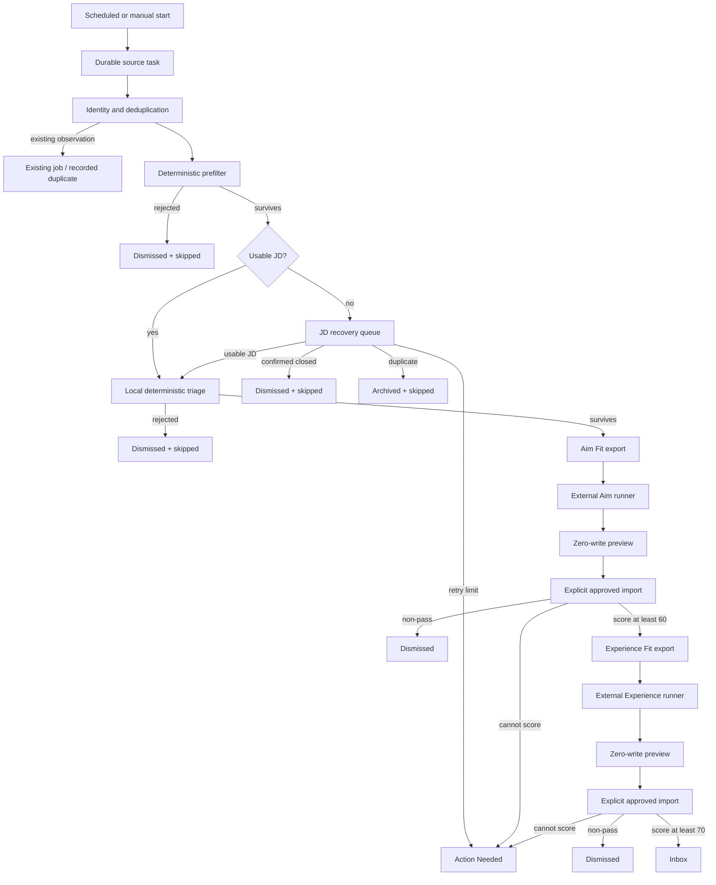

# Career Dashboard Pipeline Contract

**Status:** Current intended behavior, reconciled with the checked-out source on 2026-09-29. The source and M70 unit files remain the authority for later changes.
**Purpose:** Make the job flow explicit enough that a change to one stage cannot silently bypass, strand, or misroute another stage.
**Scope:** Discovery through Inbox admission, including the manual Aim Fit and Experience Fit exchange. This is a behavior contract, not a production-health report.

## 1. The pipeline in one view


```mermaid
flowchart TD
    start["Scheduled or manual start"] --> source["Durable source task"]
    source --> identity["Identity and deduplication"]
    identity -->|"existing observation"| duplicate["Existing job / recorded duplicate"]
    identity --> prefilter["Deterministic prefilter"]
    prefilter -->|"rejected"| earlyDismiss["Dismissed + skipped"]
    prefilter -->|"survives"| jdGate{"Usable JD?"}

    jdGate -->|"yes"| local["Local deterministic triage"]
    jdGate -->|"no"| recovery["JD recovery queue"]
    recovery -->|"usable JD"| local
    recovery -->|"confirmed closed"| closed["Dismissed + skipped"]
    recovery -->|"duplicate"| archived["Archived + skipped"]
    recovery -->|"retry limit"| action["Action Needed"]

    local -->|"rejected"| localDismiss["Dismissed + skipped"]
    local -->|"survives"| aimExport["Aim Fit export"]
    aimExport --> aimRunner["External Aim runner"]
    aimRunner --> aimPreview["Zero-write preview"]
    aimPreview --> aimApply["Explicit approved import"]
    aimApply -->|"non-pass"| aimDismiss["Dismissed"]
    aimApply -->|"cannot score"| action
    aimApply -->|"score at least 60"| experienceExport["Experience Fit export"]

    experienceExport --> experienceRunner["External Experience runner"]
    experienceRunner --> experiencePreview["Zero-write preview"]
    experiencePreview --> experienceApply["Explicit approved import"]
    experienceApply -->|"non-pass"| experienceDismiss["Dismissed"]
    experienceApply -->|"cannot score"| action
    experienceApply -->|"score at least 70"| inbox["Inbox"]
```

The arrows express dependency, not execution timing. The full pipeline supervises source ingestion, ATS processing and publication, JD recovery, local scoring, duplicate combining, and stale-lease cleanup concurrently. A separate M70 acquisition service can claim ATS board work under the shared capacity gate. A particular job must still satisfy the stage contract before it can enter the next stage.

## 2. The two state axes

Each job has two deliberately separate state axes. Do not infer one from the other.

| Field | Question it answers | Important values in this flow |
| --- | --- | --- |
| `Job.status` | What is the job's lifecycle disposition? | `pending_af`, `inbox`, `dismissed`, `archived`, and user-owned lifecycle states such as `applied` or `interviewing` |
| `Job.scoringStatus` | What processing work is required or complete? | `needs_jd`, `queued`, `scoring`, `scored`, `skipped`, `failed` |

`pending_af` is the machine-processing lifecycle state. Local survivors remain there until the two manual scoring stages make an Inbox decision. `inbox` is therefore a completed acceptance state, not a synonym for "ready to score." A protected human lifecycle state must not be overwritten by a background stage.

### Inbox posting availability

The existing daily Inbox verifier processes up to 25 oldest-due, non-manual, unstaged cards without JD/local claims per pass. Active scoring and leased cards are excluded. HTTP success alone does not prove a posting is active: an individual ATS posting object or matching posting title with substantive description is required. Empty application shells, cookie/login pages, provider blocks, throttles and transport failures remain inconclusive. A bounded safe rendered-reader fallback checks closure notices that appear after JavaScript, including Workday, and treats reader failures as operational uncertainty. WWR's confirmed posting-to-home/search redirect means its source copy is unavailable.

Before expiring an unavailable aggregator copy, the verifier attempts the existing employer matcher. A uniquely identified and verified live employer posting repairs only apply/canonical links and keeps Inbox. An uncertain employer probe keeps Inbox for another check. Confirmed unavailable postings without a live replacement retain the existing `expired` disposition and dead-URL reason. These outcomes advance the daily attempt clock and append an immutable `inbox_posting_verified` event; the event and projection commit together only if the card's original URL, updated time, Inbox state and unstaged state still agree. Scores, scoring state, descriptions and leases are preserved. Deployment needs no bulk reset: existing cards are revisited when their daily check becomes due.

Execution leases are separate from both state axes:

| Lease | Owner | Meaning |
| --- | --- | --- |
| `jdBatchId` | JD recovery | The row is claimed for bounded JD recovery. |
| `batchJobId` | Local scoring | The row is claimed for local triage. |
| `ScoringBatchItem` / manual batch data | Manual Aim or Experience exchange | The job is leased to a stored export until a valid result is imported or the lease is released. |

No stage may leave its lease set when it returns the job to a queue. A queue record with a leftover lease is a stranded job, not a harmless cosmetic inconsistency.

## 3. Canonical job-stage contract

### 3.1 Discovery, identity, and prefilter

**Owner:** `src/lib/jobIngestion.ts`

1. A durable `IngestionTask` claims a source/query/geography work item.
2. The source result is normalized and reconciled against a source observation and posting identity. A duplicate is recorded; it is not a new job.
3. The deterministic prefilter runs before downstream work. A rejected job becomes `status = dismissed` and `scoringStatus = skipped` (manual imports preserve their lifecycle status).
4. A surviving job with a complete enough JD enters `scoringStatus = queued`; an incomplete JD enters `scoringStatus = needs_jd`.
5. A positively detected closed posting is a disposition: `status = dismissed`, `scoringStatus = skipped`, and pass reason `Job posting is closed.` It is not a retryable recovery error.

The ingestion prefilter is a cheap, deterministic filter. It must not claim to be Aim Fit or Experience Fit, and it must not use the absence of evidence as a negative qualification conclusion.

### 3.2 JD quality and recovery

**Owners:** `src/lib/jobDescriptionQuality.ts`, `src/lib/jdRecoveryPolicy.ts`, and `src/app/api/jobs/batch-jd-submit/route.ts`

The JD gate admits text to local scoring only when it is safe enough to evaluate:

- reject known terminal, cookie, login, portal-shell, short, and visibly truncated content;
- for ordinary rendered-page content, require recognizable duties and qualifications as well as the minimum usable length;
- for a direct structured ATS posting-description field, retain the terminal/length/truncation checks but do not require English section-heading wording a second time;
- treat a confirmed closure separately from an unsuccessful recovery attempt.

Recovery is bounded to three attempts. The required outcomes are:

| Recovery outcome | Required result |
| --- | --- |
| Existing or recovered JD is ready | Clear `jdBatchId`, clear any stale local lease, reset recovery errors, set `scoringStatus = queued`. It proceeds to local triage. |
| Confirmed closed posting | Dismiss and skip. Do not retry or show it as a recovery failure. |
| Duplicate after recovery | Archive and skip the duplicate record. |
| Bad but retryable response | Clear the JD lease, increment the recovery attempt, retain `scoringStatus = needs_jd`. |
| Third failed attempt or interrupted lease at the limit | Clear the lease, set `scoringStatus = failed`, and retain the job for Action Needed. Do not silently dismiss it. |

The recovery route tries an ATS-specific API first and uses Jina only as a bounded fallback. A successful HTTP response is not sufficient; the shared quality decision controls admission. On a successful batch, recovery calls local scoring only for the recovered job IDs. That convenience must preserve the same local-triage contract as the normal queue.

### 3.3 Local deterministic triage

**Owner:** `src/lib/jobScoring.ts`

Local scoring is the only automatic stage after a usable JD and before the manual A/E exchange.

1. Claim only a job with `scoringStatus = queued`, no JD lease, no local lease, and an active lifecycle (`pending_af` or `inbox`). The claim atomically sets `scoringStatus = scoring` and a local lease.
2. Resolve the canonical description and re-run the deterministic prefilter with the best available metadata.
3. From a usable JD only, extract the facts the posting states outright. These are display fields, never scoring inputs, and nothing here infers: an extractor either finds an unambiguous literal statement or records nothing.
   - **Posted base salary.** One explicit employer-posted **base** range. Stored separately from score-derived compensation and displayed after the ATS badge. OTE, total compensation, bonus, commission, any non-annual period (hourly, monthly, weekly, biweekly, daily), and multiple location-specific ranges do not qualify. A monthly range is dropped rather than annualized, because rescaling would be inference.
   - **Posted travel.** The travel expectation the posting names — a percentage, a range, or an unambiguous "no travel"/"minimal". Hedged wording ("some travel may be required") does not qualify, nor do percentages belonging to benefits such as travel reimbursement. Two conflicting figures fail closed. This is text, not a score: `Job.travelScore` is the retired pre-v2 numeric field and is no longer written.
   - Both are derived wherever the description is persisted — at ingest and again when JD recovery supplies a fuller description — so a re-scrape can never leave a stale figure attached to a posting that no longer states it.
4. If the description is incomplete or severely truncated, return it to `needs_jd` (or Action Needed at the retry limit). If it is closed, dismiss and skip it.
5. Apply local title/motion triage. A deterministic rejection becomes `dismissed + skipped`; a survivor becomes `scored` and retains its processing lifecycle.
6. On an operational error, release the local lease and retry through `queued` until the limit; then surface `failed` in Action Needed.

Local scoring may reject an obvious non-target role without an external model call. It may never promote a job to `inbox`, skip Aim Fit, or skip Experience Fit.

### 3.4 Manual Aim Fit and Experience Fit exchange

**Owners:** `src/lib/manualScoringEligibility.ts`, `src/lib/scoringExport.ts`, `src/lib/scoringRun.ts`, `src/lib/scoringImport.ts`, and `src/lib/scoringRunImport.ts`

Manual scoring is an explicit, database-free exchange, not a background model loop:

1. **Aim export:** select up to 200 currently eligible `pending_af` jobs that completed local scoring (`scoringStatus = scored`), have descriptions, are not manually leased, and are eligible under the user-lifecycle rules. One stored parent run reserves those jobs and binds exact 40-job child exports. Additional eligible jobs stay ready for the next export. Each new run is capped at 200 jobs and 64 MiB.
2. **Aim result:** an external runner produces the result JSON. Dashboard preview validates membership, hashes, input versions, source identity, result structure, and lifecycle projection without writing job records.
3. **Aim apply:** only an explicit run-preview approval token permits import. Each child applies in its own existing serializable transaction. A scored survivor remains `pending_af`; a rejection is dismissed. A safe failure remains Action Needed rather than being mistaken for a fit rejection.
4. **Experience export:** selects up to 200 currently eligible `pending_af` jobs that have authoritative, current Aim survivors and stores the same parent/40-job-child structure. Additional eligible jobs stay ready for the next export.
5. **Experience review and apply:** any `hard_requirement_mismatch` blocks final artifact publication until the main Codex agent audits it against the exact JD and complete Core Evidence and produces the exact approved review receipt. Only a passing Experience result admits an unprotected job to `inbox`. A non-passing result is dismissed. A stage failure is Action Needed, not a rejection inferred from silence.

The Dashboard flow is therefore:

```text
Log -> Aim export (up to 200 jobs) -> two concurrent 40-job children -> one Aim result
    -> zero-write run preview -> explicit child-atomic apply
    -> Experience export (up to 200 jobs) -> two concurrent 40-job children
    -> hard-mismatch semantic audit when required -> one Experience result
    -> zero-write run preview -> explicit child-atomic apply -> Inbox
```

The 200-job cap applies prospectively to new exports. Existing stored runs retain their exact re-download, resume, and import behavior; their exchange readers retain the historical 2,000-job ceiling. Existing scores are preserved.

Generating a result file, downloading an export, or previewing an import is never authorization to mutate the Dashboard database.

The external run controller at `scripts/run_scoring_run.py` has no Dashboard or
database access. It validates the immutable parent and child manifests,
persists local recovery state, runs at most two child batches concurrently,
and enforces one four-call semaphore across the full run. Restarting the same
exact input skips hash-validated completed children. It emits one consolidated,
byte-verified Desktop upload only after all children finish and, for Experience,
the required semantic audit is complete. It never previews, applies, releases,
or combines Aim and Experience on its own.

Run import is intentionally atomic per child rather than across the entire
queue. If a later child fails current-input or lifecycle validation, earlier
children remain durably accepted and the operator re-previews the same run to
continue. Explicit run release frees only still-leased children and preserves
all previously accepted scores. Superseded children stay visible as a blocked
run until that release; no scoring change automatically invalidates historical
accepted scores.

## 4. Scheduler and concurrency contract

**Entrypoint:** The M70 scheduler timer invokes `scripts/cron/run_pipeline.ts` once a minute; the Dashboard also permits a manual start. Both use the durable `PipelineState` lock. A pause blocks scheduled starts. Stop and deployment quiescence signal active work to drain without changing Joseph's pause intent.

The current pipeline route supervises these loops with warning isolation and bounded restart behavior:

| Loop | Work it owns |
| --- | --- |
| Source ingestion | Due non-ATS task claims, provider budgets and retries, source counters, and completion-based cadence. |
| ATS acquisition or legacy fallback | Board listing and detail work when its durable capacity gate grants local slots. |
| ATS segment publication | Sealed-to-published handoff for ledger segments. |
| ATS batch processing | Network-complete batch normalization, Job persistence, and consumer leases. |
| JD recovery | Bounded structured recovery, Jina fallback, and recovery leases. |
| Local scoring | Deterministic triage of queued jobs. |
| Duplicate combining | Periodic same-job checks, in addition to checks before export and after scoring import. |
| Stale-lease cleanup | Recovery of expired work without inventing a score. |
| ATS remote telemetry | Read-only observation of distributed capacity and backlog. |

A failure in one loop is recorded and retried without tearing down unrelated work. The pipeline route remains the owner of the shared lock and the job-processing loops. Its attached ATS acquisition child exits cleanly when the durable gate reserves no local slots.

The M70 also has a separate `career-dashboard-acquisition.service`. It runs the portable continuation worker on the **same M70**, with the historical logical lane label `mac-continuation`. That label is a database lease identity, not the machine's location. The durable gate fences its capacity against the pipeline's local acquisition path and controls whether it can claim work. The separate worker does not own the pipeline lock, job persistence, manual scoring, or a second database. The old Mac LaunchAgent and the Pi Dashboard are not production workers.

### 4.1 Source scheduling

Each non-ATS source task is identified by source, query family, geography lane, and ingestion mode. A task is claimed only when due; its next run is anchored to completion. Provider budgets, cooldowns, circuits, and retries are distinct from a job's fit decision. A successful provider request is not proof that the job passed the shared quality gate. The historical `scheduler:v2:legacy-orchestration` row is metadata, not a runnable source task.

The Common Crawl board-discovery timer is separate from active acquisition. The Gusto board and canonical URL browser timers are separate again. A checked-in timer definition does not prove that unit is enabled; systemd is the host authority.

### 4.2 ATS acquisition and durable handoff

The acquisition ledger separates listing contact, immutable page observations, detail enrichment, canonical resolution, segment sealing, publication, and Job persistence. Board liveness or contact telemetry must not be reported as completed Job ingestion. Work receipts, leases, cursors, and counters permit bounded resume after interruption. Backlog pressure can hold new board admission while already downloaded work drains.

For a ledger-backed board, listing and detail quanta run under capacity leases. Raw observations become canonical items or terminal compaction evidence. Contiguous terminal items seal into manifests; publication makes bounded segments available to the parent consumer. The consumer verifies payload integrity and persists a committed prefix with exact counters so normal restarts do not replay it. An individual segment completing does not prove its whole board cycle complete. Legacy synchronized batches continue to drain through the batch consumer when a producer mode changes.

Zoho Recruit discovery identifies the regional tenant hostname and named public career page together. Acquisition verifies that page's public catalogue identity and employer branding, then reads its complete public feed without offset pagination. Only explicitly published postings with a valid identity, title and description enter the normal handoff. An unpublished row does not create a candidate or dismiss an existing job. Malformed catalogues and authorization failures stay scoped to the board; genuine rate limits, transport failures and server failures retain shared provider protections. Matching against a known Zoho board requires a unique compatible posting and can enrich only the guarded job's links and description. Existing jobs need no migration or bulk reconciliation for this adapter.

The `Direct ATS acquisition` task and legacy per-platform tasks are mutually exclusive producer modes. Mode transition preserves cursor, counters, and evidence, and must not alter a running leased task. A producer-mode change is not permission to discard already synchronized work. A provider-wide cooldown postpones its unprocessed suffix instead of publishing an incomplete posting as final.

The weekly board-pruning service has two different authorities. Its liveness arm contacts demoted boards and can automatically promote boards that still carry postings or retire boards confirmed gone, subject to the sweep's own refusal guards. Geography, unproductive-board, and low-yield arms only report exact candidates and require the printed `--apply --selection-hash` command after review. An excluded board is not automatically reconsidered, which is why those arms have no standing write authority.

### 4.3 Score and lifecycle boundary

Acquisition ledgers, worker leases, publication receipts, source scheduling, and board cleanup do not authorize a change to existing Aim or Experience scores. Scoring policy, model, prompt, evidence, runner, schema, and version changes apply prospectively. Only Joseph's explicit score-removal request or a Dashboard rescore action can displace an existing score. Background updates must also preserve protected human lifecycle decisions.

## 5. Audit evidence and observability

The mutable `Job` row tells us the current state. It is not enough to reconstruct how the job got there.

- `JobPipelineEvent` is the append-only, idempotent trail for ingestion, prefilter, JD readiness/recovery, local outcomes, manual A/E outcomes, user lifecycle changes, duplicates, and processing errors.
- `JobSourceObservation` preserves source identity and source-task attribution.
- `IngestionTask` preserves task lifecycle, lease, counters, watermark, cursor, error state, and next-run time.
- `JobScoreEvent` is the immutable authority for imported Aim and Experience decisions.
- `PipelineStateEvent` records run, stop, pause, warning, and error transitions for the shared runner.

For ingestion telemetry, reconcile `seen = inserted + duplicates + filtered + processingErrors`. Provider/request errors are separate operational telemetry; they are not failed individual jobs and must not be included in the seen-job denominator.

## 6. Invariants that changes must preserve

1. Every surviving job is either in a known next-stage queue, leased by exactly one active stage, completed, deliberately skipped, or visible in Action Needed.
2. No stage advances a job merely because an HTTP request succeeded; admission is based on the stage's shared validation contract.
3. A closed posting, a duplicate, a deterministic local rejection, an operational failure, and a model-fit rejection have different meanings and must remain separately observable.
4. `needs_jd -> queued -> scoring -> scored` is the automatic survivor path. Recovery must not jump directly to Aim or Inbox.
5. Local triage is a cost-control and deterministic routing stage; it is not an automatic acceptance authority.
6. Aim and Experience scoring are separate stored exchanges. Preview is zero-write; apply requires explicit approval and validates the stored export against current source inputs.
7. Human lifecycle decisions are protected. Background work must not revive, dismiss, or overwrite a user-owned lifecycle state unless an explicit route authorizes that action.
8. A provider failure is contained to its task. It may change that task's retry state, but it must not stop unrelated job stages.
9. A retryable failure consumes a bounded attempt and eventually reaches Action Needed; it may not spin forever or be silently discarded.
10. A queue transition clears the previous stage's lease. A job with contradictory queue/lease values is a correctness defect.

## 7. Code ownership map

| Concern | Primary owner |
| --- | --- |
| Full-run lock, loop supervision, stops, stale-lease cleanup | `src/app/api/pipeline/run/route.ts`, `src/lib/pipelineState.ts` |
| Source catalog, scheduling, task leases, counters, and completion cadence | `src/lib/ingestionTaskCatalog.ts`, `src/lib/ingestionControl.ts` |
| Source ingestion, identity, deduplication, and initial routing | `src/lib/jobIngestion.ts` |
| JD validity and closed-posting detection | `src/lib/jobDescriptionQuality.ts` |
| Bounded recovery decisions and terminal/reconciliation updates | `src/lib/jdRecoveryPolicy.ts` |
| JD recovery execution | `src/app/api/jobs/batch-jd-submit/route.ts` |
| Local claim, canonical-description resolution, and deterministic triage | `src/lib/jobScoring.ts` |
| Manual stage eligibility and export | `src/lib/manualScoringEligibility.ts`, `src/lib/scoringExport.ts` |
| Preview, approval, atomic import, score authority, and lifecycle projection | `src/lib/scoringImport.ts`, `src/lib/scoringApproval.ts` |

## 8. Reading this contract during an incident

Start with the exact job state and recent immutable events, then ask one narrow question at a time:

1. Was the job discovered, filtered, deduplicated, or rejected before creation?
2. If it is in `needs_jd`, is the JD lease active, stale, retryable, terminal, or actually a confirmed closure?
3. If it is `queued`, is a stale lease preventing local scoring from claiming it?
4. If it is `scored + pending_af`, was the next manual export created, leased, previewed, or applied?
5. If it is `failed`, what stage created the failure and is it correctly shown as Action Needed rather than dismissed?
6. If a source is behind, is the source task due/running/blocked/retired, and does its counter reconciliation hold?

Do not diagnose from a single Dashboard count alone. Use the job row, its pipeline events, relevant lease, and the owning task or batch record together.
