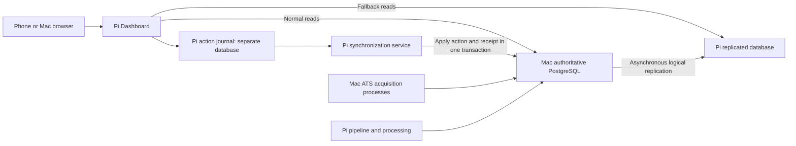

# Mac database authority, Pi mirror, and offline application updates

> **Historical proposal, superseded September 2, 2026:** Joseph chose Ubuntu Server on the Lenovo M70s and will keep Claude and Codex on the Mac. Follow [the M70s server decision and preparation notes](M70S_UBUNTU_SERVER_PREPARATION_2026-09-02.md) for the current direction. The inspection below remains useful background, but its Mac-primary replication and action-journal design is not the selected implementation. No migration has taken place.

Prepared September 2, 2026, from read-only inspection of the Mac, production Pi, repository, and PostgreSQL documentation. Investigation complete; implementation, installation, deployment, and database migration have not begun.

## Intended behavior

Joseph wants PostgreSQL on the Mac's internal storage for faster database work, while retaining access to the Pi-hosted Dashboard from his phone. If the Mac is unavailable, the Pi must still show its latest replicated data and accept actions such as marking a job Applied. Those actions must survive refreshes and Pi service restarts, then synchronize when the Mac returns.

The Mac remains the only authority for application data and pipeline coordination. The Pi owns a separate, durable journal of human actions awaiting confirmation. Losing contact with the Mac does not promote the Pi's replicated database into an independent writable authority.

This plan preserves existing job scores, score history, application decisions, and acquisition evidence. Changing database hosts or replication metadata never invalidates scores. The Dashboard keeps its existing access model without adding a login screen.

## Findings that determine the build

| Verified finding | Consequence |
|---|---|
| Mac: M3 Pro, 12 CPU cores, 18 GB memory, internal Apple SSD; macOS 26.6.2 | Native PostgreSQL is a credible performance improvement, subject to a representative benchmark. |
| macOS reports 192.67 GB available for important usage; approximately 73.7 GB is currently free | About 119 GB of the available estimate is reclaimable. Plan and monitor actual free space as well as macOS's estimate. Storage is not an immediate reason to reject the move. |
| The inspected Windows VMware package occupies approximately 43.77 GB in allocated file blocks | Its configured maximum virtual capacity must not be counted as additional space to reclaim. APFS snapshots/clones make package allocation different from a guarantee of space recovered by deletion. No VMware files were modified. |
| Mac's existing PostgreSQL executables are Homebrew 16.15, Intel x86_64, under `/usr/local`; no PostgreSQL server process was observed | Use a separate native ARM64 PostgreSQL 17 installation through `/opt/homebrew`; leave the old installation and any old data untouched. Explicitly select executable paths. |
| Pi runs PostgreSQL 17.10 on Linux ARM64; database is approximately 16 GB | Keep PostgreSQL major version 17 on both hosts. The current Homebrew ARM64 package is 17.11; recheck the exact available patch version at build time. |
| All 49 public tables have primary keys; all are permanent; no sequences, large objects, row-level security, or custom public collations were found | The existing schema is suitable for logical replication. There are 48 application tables plus the migration bookkeeping table. |
| Extensions are `pg_trgm` 1.6 and `btree_gist` 1.7; one segment-overlap exclusion constraint exists | Restore SQL-owned extensions, expression indexes, constraints, and triggers. Reconstructing the database solely from the Prisma schema is insufficient. |
| Database uses UTF-8 British locale through the operating-system locale provider; the locale exists on the Mac | A matching locale name does not prove identical text sorting or case conversion across Linux/macOS. Test search, lower-case identity lookups, and index behavior after logical restore. |
| Pi has no publication, subscription, or replication slot; change logging is set to `replica`, not `logical` | Replication needs explicit provisioning. The recommended final-copy cutover below avoids requiring the current Pi to become a logical publisher first. |
| All 11 inspected application triggers fire in the ordinary origin mode | Replicate their resulting history/evidence rows. Do not enable those triggers to run again during normal replica application, which could duplicate effects. |
| Eight Mac ATS acquisition slots are live; the Pi reserve is zero | Retain the existing concurrency initially. Changing database location does not authorize increased provider traffic or additional acquisition slots. |
| Pi serves the Dashboard directly on its Tailscale address, port 3000; Tailscale Serve is not configured | Phone access can keep using the existing Pi address. The phone does not need direct access to the Mac database. |
| Pi service and health checks were healthy | No operational repair or restart was needed for this investigation. |

The database's largest relations include jobs with indexes/large text (~4.3 GB), downloaded ATS pages (~4.0 GB), listing observations (~2.9 GB), and substantial pipeline/event history. A complete mirror still makes the Pi apply database writes; it does not remove all database disk work from the Pi.

A 147.5-second observation produced 48.76 MiB of additional PostgreSQL WAL, about 0.33 MiB/s. This is a brief physical-log measurement, not a forecast of logical replication network bandwidth or peak throughput. It establishes why replication retention must be bounded. A job-list request took 1.19 seconds. A Stats response took 0.29 seconds but served data 1,767 seconds old; that response time is not a measurement of fresh Stats computation.

Sources: [native PostgreSQL 17 package](https://formulae.brew.sh/formula/postgresql@17), [logical replication configuration](https://www.postgresql.org/docs/17/logical-replication-config.html), [replication restrictions](https://www.postgresql.org/docs/17/logical-replication-restrictions.html), [locale behavior](https://www.postgresql.org/docs/17/locale.html), [Apple available-space explanation](https://support.apple.com/en-ie/guide/disk-utility/dskutl1005/mac).

## Recommended architecture for the first build

Keep the web application and pipeline parent on the Pi initially. Moving the whole application/pipeline to the Mac is a separate performance decision; it is not necessary to implement the requested database authority and offline edits. This first build does not need a second public web application or a new Mac HTTP service: the Pi synchronization process can execute the shared mutation service against PostgreSQL on the Mac.

The Mac acquisition processes use the local authoritative database. Pi normalization/persistence, publication, provider controls, scoring imports, cron, and other existing writers use the Mac database over Tailscale. Pipeline/control clients never fall back to the replica. If they cannot reach authority, they stop admitting new work and preserve existing durable work for normal recovery. Already-running external requests require the existing reservation/checkpoint rules; loss of a database connection is not permission to repeat a provider call blindly.

Use three explicit database purposes, with separate credentials and instance/role checks:

1. **Mac authority:** normal application writes, pipeline locks, provider budgets, command receipts, and human-edit revisions.
2. **Pi replica:** application credentials permit reads only. A dedicated replication role applies changes. Old writer credentials must not continue writing here after cutover.
3. **Pi action journal:** a small separate database on the Pi SSD. The Dashboard and synchronization service can write here. Replica rebuilds and replacement restores must not touch it.

Do not mutate a shared global Prisma client's target during an outage. Choose one source per read request and pass the selected client through list queries, detail queries, score projection, counts, and helper functions. A failed read may be retried in its entirety against the replica; a transaction must never mix sources. Existing separate data and control pools remain bounded.

Replicate all 48 existing application tables, plus the new authoritative command receipt/revision/heartbeat tables, in one subscription. Exclude each host's migration bookkeeping and the separate Pi journal. This maintains transaction ordering across job changes, status history, score evidence, and command receipts. Do not silently drop acquisition tables to make a benchmark pass; that would change the promised mirror and fallback telemetry.

Sources: [logical replication](https://www.postgresql.org/docs/17/logical-replication.html), [transaction ordering and trigger behavior](https://www.postgresql.org/docs/17/logical-replication-architecture.html).

## Durable action protocol

Production human lifecycle actions should always enter through the Pi journal, including while the Mac is healthy. This gives one retry protocol and preserves actions when the Mac commits but the response connection fails. Browsers on both devices use the Pi-hosted production application.

The proposed journal records an action UUID, protocol version, journal instance ID, monotonic action sequence, job ID, allowed action kind, validated payload, prior human revision or preceding queued action, server-recorded action time, payload digest, retry information, and result/conflict details. The timestamp is stamped by the Pi when it accepts the action; arbitrary client clocks do not determine application dates. Payload digests protect retry consistency and do not decide job or score authority.

Suggested journal states are awaiting authority, processing under a short lease, committed awaiting replication, synchronized, conflict, and rejected. These names are implementation metadata; the UI uses plain descriptions such as “Waiting to sync,” “Saved; updating local copy,” and “Needs review.”

Processing sequence:

1. Validate the action and persist it on the Pi before acknowledging acceptance. If the Pi cannot persist it, show failure; do not claim the change was saved.
2. Return the effective job state with the queued action overlaid. A queued acceptance is distinguishable from an authoritative commit, including in the HTTP response contract.
3. A dedicated supervised Pi service leases queued actions, processing dependent actions in order. It reconnects with bounded retries and can recover after either host restarts.
4. In a Mac database transaction, check the authority identity, check or create the action receipt, lock the target job, validate the expected human revision, run the existing domain behavior, advance its human revision, and commit the receipt/result with all effects.
5. Retrying the same UUID and payload returns the recorded result. Reusing the UUID with a different payload is rejected. Unique receipts make lost responses safe without a cross-database distributed transaction.
6. Keep the pending overlay until the matching receipt is visible in the same Pi subscription as the job/history changes. A returned HTTP success or a heartbeat alone does not prove the replica contains the action.
7. Preserve completed receipts long enough to cover client retries, journal restore, and replica rebuild. Establish retention by an explicit safe checkpoint; do not prune receipts simply because an action is old.

The ordinary job `updatedAt` field is not a suitable human-conflict version: background ingestion and scoring also change it. Introduce a prospective human revision that every human mutation path increments. It starts without rewriting existing lifecycle or score history. Conflicting later human edits, missing jobs, or consolidated IDs are surfaced for review; do not silently retarget or discard actions. Independent fields may merge only under an explicit tested field-level rule. Default same-job lifecycle conflicts require review. Dependent later actions stay pending behind their conflict.

Human updates made by other production paths, including tailoring imports, must participate in revision accounting. The existing development checkout and one-off administrative scripts must not be left as accidental ways to write the Pi mirror or bypass the primary's action rules.

## Preserve the meaning of Applied

The generic job-update route currently performs several actions in one transaction when a job becomes Applied or Interviewing:

- Set lifecycle state and maintain the applied-job identity.
- Suppress eligible duplicate postings using the existing protections.
- Place eligible same-company Inbox jobs into the existing 21-day cooldown.
- Record the human lifecycle event and database-triggered status history.
- Verify lifecycle invariants.

Extract this behavior into a shared transaction service used by immediate actions and replay. Do not implement replay as a bare status-column update. Retain existing exceptions for protected user decisions and manual imports.

**The original action time must survive replay.** Today, status history uses database transaction time, and cooldown logic derives dates from that history. If Joseph marks a job Applied on Monday while the Mac is off, Tuesday's sync must not silently move the application date or restart its 21-day cooldown from Tuesday. Carry the server-stamped Monday time through the action service and the history trigger using transaction-local action context; non-action writes keep their existing timestamp fallback. Keep actual commit/sync time separately. This is prospective and must not rewrite old history.

Offline effects need a display overlay for both the selected job and affected related jobs. Reuse a pure decision planner for current duplicate/cooldown rules. When authority returns, recompute and verify those decisions against current authoritative state. Show conflicting consequences for review instead of silently replacing another human decision.

Affected code: `src/app/api/jobs/[id]/route.ts`, the dedicated pass/promote routes, `src/lib/companyCooldown.ts`, `src/lib/appliedDuplicateStore.ts`, `src/lib/jobLifecycleEvents.ts`, `src/lib/jobLifecycleInvariant.ts`, `src/app/api/tailoring/import/route.ts`, and the history trigger introduced by `prisma/migrations/20260808210000_stats_reconciliation/migration.sql`.

## Offline UI and route scope

The first build should support existing job lifecycle actions: Applied, Interviewing, Bookmark, Pass with its reason, and the existing restore/promote behavior. Include tailoring-stage toggles with their existing one-job-per-company validation. Store every accepted action durably, with errors and conflicts visible.

Generic job metadata/URL edits, JD fetching, manual job imports, scoring export/import/retry/release, bulk tailoring imports, pipeline controls, and LinkedIn/outreach generation continue to require authority in the first version. They must give a clear “Mac unavailable” response instead of writing the replica or claiming completion. General job notes are not an existing field in the inspected Job model; adding notes is separate feature scope, despite the earlier conversational example.

Read fallback is an explicit route allowlist, not a rule that all GET requests are harmless. The LinkedIn status GET currently downloads completed batch results, deletes/recreates drafts, and updates database state. Split read-only status from harvesting before enabling fallback there. The pipeline-status route may fall back to a local runtime file; fallback telemetry must instead distinguish replicated historical state from current availability.

Required presentation details:

- Keep the existing Pi address and no-login behavior.
- Show whether reads come from the Mac or Pi copy, last replicated heartbeat time, and pending action count.
- Show old pipeline activity as last-known activity when authority is unreachable. Do not label stale replicated leases as live Pi work.
- Pending status changes affect filtering, sorting, pagination, counts, company views, search results, and detail views. Overlaying only the already-returned page would make Applied jobs disappear from both tabs or cause incorrect totals.
- The Pi journal is a different database, so it cannot be joined directly with the replica using ordinary SQL. Read a bounded journal snapshot, build an overlay plan, and feed that plan as parameters into the selected database query. Combine indexed unaffected rows with affected rows before pagination. Do not load all ~807,000 jobs into application memory to overlay a small pending set.
- Cache keys include source, replica/journal generation, and schema compatibility. Do not reuse a primary response as proof of replica freshness. A refresh or browser restart must preserve pending updates.
- While fallback Stats represent a historical snapshot, identify pending human changes separately; do not fabricate current pipeline rates from cached data.
- Loss of phone-to-Pi connectivity is outside the Mac-offline guarantee. An action is accepted only after the Pi acknowledges its durable journal entry.

Source-selection changes must reach `src/lib/prisma.ts`, `src/lib/controlPrisma.ts`, database URL helpers, job list/search/detail routes and their score/query helpers, Stats/status/health routes, `src/components/Dashboard.tsx`, `src/components/JobCard.tsx`, `src/components/ExpandOverlay.tsx`, and client job/response contracts. Some score helpers already accept a transaction/client parameter and can be reused.

## Replication, storage, and recovery

Use asynchronous logical replication so a slow/offline Pi does not put every Mac commit behind the Pi's storage. The replica may lag, and that lag must be visible. A separate replicated heartbeat helps distinguish an idle healthy stream from a disconnected one; command-specific receipts establish whether a particular user change arrived.

The current maximum replication-slot log retention is unlimited. The Mac configuration must use a finite WAL-retention budget, disk-space alerts, and a replica-reseed procedure. Pick the final budget after measuring representative load and actual disk headroom. Retention is enforced at checkpoints and is not an exact disk-usage cap. If a slot becomes unusable, keep the old Pi copy browsable as stale, preserve the journal, build a replacement replica in a separate database, validate it, and swap readers. Never skip conflicting replication transactions merely to make the status green.

The replica is not an independent historical backup: destructive changes at authority can replicate. Back up the Mac authority and Pi journal separately, retain an off-Mac copy, and rehearse restores. The existing backup script checks process exit and nonempty output; that is not proof of a successful restore.

Provision the Mac service with an explicit ARM64 PostgreSQL path, data directory on internal storage outside the repository/cloud-sync folders, log rotation, and restart supervision. Use the native PostgreSQL 17 dump/restore tools; the current Mac 16 dump utility is not the right tool for the Pi 17 server. Restore into a fresh database rather than copying Linux database files or running a major-version downgrade.

Initial tuning should be conservative and measured: preserve current concurrency, bounded connection pools, and work-memory discipline. More installed memory does not justify assigning all 18 GB to PostgreSQL. Confirm query plans, checkpoint behavior, replication apply load, and Mac memory pressure before tuning further.

The Mac has FileVault enabled, and its existing acquisition LaunchAgent depends on a user session. Cold boot, disk unlock, login, service start, and Tailscale recovery are separate acceptance tests. Keep Pi fallback operational throughout; do not promise database availability before the encrypted volume is accessible.

Sources: [bounded slot retention](https://www.postgresql.org/docs/17/runtime-config-replication.html), [replication conflicts](https://www.postgresql.org/docs/17/logical-replication-conflicts.html), [portable logical backups](https://www.postgresql.org/docs/17/app-pgdump.html), [replication permissions](https://www.postgresql.org/docs/17/logical-replication-security.html), [FileVault management](https://support.apple.com/en-ca/guide/security/sec8447f5049/web).

## Deployment and migration integration

The deployment script currently writes a Pi-loopback database override, runs migrations from the Pi release, warms Stats, and then restores cron. The Mac acquisition launcher explicitly refuses a loopback database. Both assumptions must change deliberately.

Introduce explicit primary, replica, and journal connection settings and database-instance identity checks. Migration/backup tools must use the same intended authority as runtime clients; the current mixture of raw `DATABASE_URL` consumers and runtime-host overrides is unsafe for a two-host topology. Audit direct Prisma constructions in maintenance scripts as well as long-lived services.

Schema changes are not replicated. Maintain each database's local migration history. For future additive schema updates, prepare the replica first, then authority, verify compatibility, refresh the publication/subscription table set when appropriate, and only then enable code requiring the change. Data backfills run at authority and replicate; subscriber migration execution must not independently rerun the same data transformation. Migration automation must distinguish schema steps from data steps, and block an incompatible publisher release while the Pi is unavailable.

For a fresh replica, restore schema/functions/indexes/constraints explicitly and validate migration bookkeeping against the actual schema. Do not copy authority migration rows as a shortcut for applying a change on the replica. The new action journal has its own migration lifecycle and survives application-release swaps.

Retain GitHub-to-Pi deployment, release identity checks for acquisition processes, quiescence, and guarded application rollback. The current workflow cancels an in-progress deployment when another starts; any multi-host activation/cutover needs a serialized non-interruptible critical section with durable phase records. No ordinary push should automatically move database authority until the cutover is explicitly selected.

As inspected, local HEAD was `340dbdd0e8ba923bbeef73fb98f607375c0ba3d5`; live Mac acquisition leases used `715530325140260a5ee0c2d49bf81e79fa82c4e1`. The local and Pi Prisma schemas matched, but the local job-update route included URL reconciliation not yet present in the Pi copy. The local latest commit also redirects daily backups to the SSD, while live cron still wrote daily dumps to the microSD-backed directory. Treat these as a moving release baseline to reconcile before building/cutover, not changes to overwrite during this investigation. No deployment was attempted.

## Build sequence and acceptance gates

1. **Extract and test lifecycle behavior.** Share the existing action transaction, add prospective human revisions and atomic command receipts, and preserve original action time. Cover pass/promote/tailoring import paths and existing score/lifecycle invariants.
2. **Build the Pi journal and synchronization service.** Implement acceptance, leases, retries, duplicate-request behavior, conflict display, and dependent-action ordering. Test against disposable databases.
3. **Build source-aware reads and overlays.** Add explicit clients, read-route allowlists, consistent filtering/counts/pagination, truthful health/status, and source-aware caches. Keep pipeline writes primary-only.
4. **Provision an isolated native Mac test database after authorization.** Restore a verified copy, including SQL-owned schema objects. Compare job/score/history data, locale-sensitive behavior, and actual query plans. Production remains on the Pi during this rehearsal.
5. **Rehearse logical replication and failures.** Use disposable databases first, then a shadow replica with representative load. Measure lag and disk growth. Prove journal survival during replica replacement.
6. **Integrate dormant deployment support.** Test two-host schema compatibility and release/rollback behavior. Confirm backup destinations and restore results. Do not change production authority as a side effect of installing code.
7. **Perform the selected cutover after explicit authorization.** Use the rehearsed procedure below and prove live activation on both hosts and phone access.

Required tests include:

- Mac disconnected; mark Applied; refresh; restart Pi app/sync service; the accepted action and correct tab membership survive.
- Mac commits and response is lost; retry produces one action receipt, one lifecycle transition, and no repeated cooldown extension.
- Applied then Interviewing while disconnected; ordering and original dates survive replay.
- A later conflicting human edit; neither intent is silently discarded, and unrelated jobs continue syncing.
- Existing duplicate suppression, protected statuses, manual-import exceptions, one-company tailoring rules, and 21-day cooldown behavior are unchanged.
- Background scoring updates do not create false human-revision conflicts or invalidate existing scores.
- Primary job data and Pi score history cannot be combined within one response; fallback preserves complete score authority.
- Delayed replication after a successful commit; no status flicker and no premature removal of the overlay.
- Mac unavailable; pipeline/control code cannot acquire locks, reserve provider budgets, or write into the replica.
- Read-only fallback cannot trigger LinkedIn harvesting or other hidden writes.
- Replica reseed and journal restore preserve pending/conflicted actions and receipt deduplication.
- Mismatched schema/release, full journal disk, unavailable primary, invalid slot, and interrupted deployment report the actual failure without hiding accepted work.
- Actual phone access through Tailscale, Mac reboot/login recovery, and Pi reboot recovery.

Performance gates compare equivalent datasets, cache conditions, and concurrency: job-list/search latency, fresh Stats computation and age, database transaction time, normalization/persistence throughput, publication throughput, replica apply lag, retry rates, and Mac memory/disk pressure. Do not compare a cached Stats response with a fresh calculation or increase acquisition concurrency to manufacture an improvement. A full sustained replica that cannot keep up is a failed readiness gate; reassess before production cutover.

## Cutover and rollback procedure to rehearse

Prefer a straightforward final-copy cutover whose downtime is measured in rehearsal. Do not promise a duration from the current database size alone; today's live daily dump ran from approximately 03:15 to 03:53.

1. Deploy compatible dormant code and the durable journal first. During cutover the Pi can queue new human lifecycle actions while serving its last data. Clearly indicate pending authority.
2. Stop new producer admission, quiesce the Pi pipeline and all eight Mac acquisition slots, and verify zero live leases, transactions, and process-owned locks. Preserve unfinished durable acquisition work; do not abandon or reset it to make quiescence pass.
3. Fence every old application writer, including local development/maintenance connections. Record a cutover epoch and a final consistent database backup. The Pi dataset must remain unchanged after this point.
4. Restore that final snapshot to the Mac's fresh database and validate all application tables, IDs, score values/authority, lifecycle history, constraints, indexes, and schema bookkeeping. Recreate database roles separately; the current backup omits owners/privileges.
5. With Mac writers still disabled, create the publication/slot and connect the already-identical Pi application tables as subscriber without recopying data. Omitting initial copy is permitted only after equality and the no-write interval are proven. Otherwise use a separately initialized replica and keep cutover paused.
6. Verify replication identity/health and enforce Pi application read-only credentials. Select the Mac as the one authority, point all runtime/control/maintenance clients there, then process accepted journal actions before resuming background ingestion. Resume existing work through the existing lease/recovery rules.
7. Verify normal and disconnected phone behavior, receipt replication, correct dates/history, scores, fresh Stats, and both hosts' services/releases. Retain the pre-cutover backup.

Before the Mac accepts new authority writes, an aborted cutover may return to the frozen Pi after detaching any subscription and restoring the verified old role/configuration. After the Mac accepts writes, rollback is a data reconciliation operation: fence Mac writers, establish that the Pi received the final changes or restore the latest authoritative snapshot, preserve the journal, reconcile receipts, and explicitly select one writer. If the Mac is inaccessible and unsent changes may exist, continue fallback/queue mode; do not automatically promote the Pi and claim it is current.

If rehearsal shows final-copy downtime is unacceptable, prepare a separate online-copy/change-capture migration design. Do not quietly replace this procedure with an untested replication-direction reversal during cutover.

## Preparation status

The architecture, code surfaces, live schema constraints, platform prerequisites, deployment assumptions, action semantics, migration procedure, and acceptance tests are identified. No product decision blocks starting the proposed first build. The first offline action scope is stated above; broad offline metadata edits/imports or a full Mac-hosted pipeline would expand it.

The work remaining after build authorization is implementation, isolated restore/replication/failure testing, performance measurement, supervised service setup, and deployment integration. Production migration remains a separate explicit action. The exact speedup, replication lag under sustained load, restoration duration, and cold-boot behavior cannot be proven by read-only inspection alone.

Only this preparation document was added by the investigation. No application code, database data/configuration, service state, cron, installed software, Git commit, push, or production deployment was changed. The pre-existing untracked `scripts_queue_check_tmp.ts` was left untouched.
